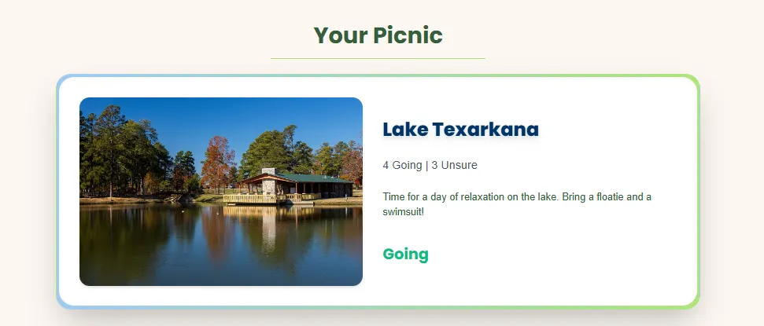
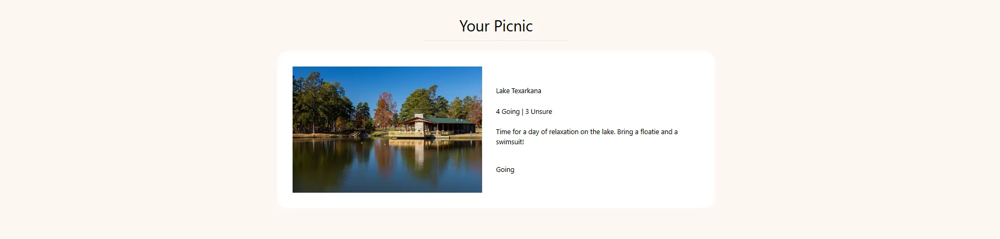
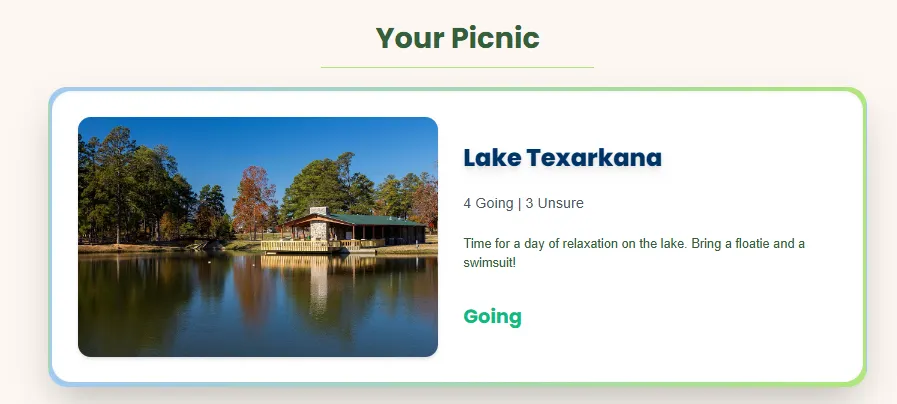

# Creating the Featured Item
Let’s continue with our site by making our next component - The Featured Item!

It’s going to be similar to a typical Hero section, which is the first thing users see on a webpage. It usually displays a popular or important item to make an immediate impression.

# Overview

This guide builds on your previous skills by:

- Practicing **layout** and **flexbox** with Tailwind CSS to position text and images.
- Using **backgrounds, borders**, and **spacing** to style elements.
- Handling **images** to make sure they fit without losing quality.
    1. To **download** the folder of images that we will be using for this project, go [here](https://drive.google.com/drive/folders/1EZPZ6Bk8LSWjxR1agSwUOaER-5UJqwnf?usp=drive_link).
    2. Create a new folder in `root\public` called `\images`. Download the file and save the **contents** into this folder. Or drag the entire folder into `\public` if you prefer.

Here’s what our section will look like at the end.

---

## **Challenge 1: How do you set up a component?**

> **Can you remember how we created a component from the previous lesson? What about importing it?**

1. **Create a New Component**: *Hint: Which folder does this belong in?*
2. **Add the Structure**: Write a function `FeaturedItem` that returns a `
` and export it at the end. *Hint:* *Use the shortcut ‘rfce’*  
[Answer](https://pastebin.com/3QcCxDpw)
3. **Import the Component:** This can be done in the same way we imported the Navbar
[Answer](https://pastebin.com/2X6673De)

---

## **Challenge 2: Can you replicate this skeleton structure?**

1. Inside `FeaturedItem.jsx`, delete the ‘FeaturedItem’ text within the div and you should be left with an empty div. 
2. Let’s dissect the image before we get into the answer:
    1. First, notice how all of the content is **centered**. We also have a margin at the top that spaces the words **away** from the Navbar. 
    2. Below that, we have a small line that **separates** the box from the text. It takes up about a **third** of the page horizontally.
    3. And then we have our main box. It contains two elements, an **image** and another box with **text**. The box on the right has an even Y axis spacing of the texts.

**Tips:** 

1. We have many more `
` elements than meets the eye.
2. For the image, you can use the same one we downloaded earlier or find one of your own. Make sure that it’s high quality and has a good aspect ratio. In the attributes of your `` HTML element, there’s an `src=''` attribute that specifies the *relative* path to the file **from the public** folder. Therefore the file path should be `src="/images/Texarkana.jpg"` because the `\images` folder resides in the `\public` folder.
3. As for the separate texts, they should all be contained inside a single `
` with even vertical spacing except for the last “Going” element, which has additional padding at the top.  
    [Answer](https://pastebin.com/c8kMZdvd)
    

Note that the answers from hence forth will start to get a little more *complicated*. If you’re ever lost, please do not hesitate to reach out either at our Help Desk located in the Atrium or on discord 

---

## **Challenge 3: How should we style our component?**

Take a closer look at our final product. In comparison to our skeleton, what **differences** do you notice that we have to implement? Let’s go through them step by step

1. Starting with the background/box. We need to add this gradient border that goes from blue to green. How can we do that?  

  **Answer**: Adjust the styling for the main BOX element. Replace `bg-white` with `bg-gradient-to-r from-pastelblue to-pastelgreen`. Let’s also add `shadow-2xl` .  
Your page should look like [this](https://imgur.com/a/N2TWIop).
2. Our title should be dark green, bold, and the horizontal line should also be green. 

  **Answer**: For this, we need to add `poppins-bold text-darkgreen` to our Title element. And for the `
` element, we need to add `border-pastelgreen`
3. But what about that white background? This is where that somewhat random `
` that we created earlier is going to come in.  
  **Answer**: Find the inner `
` with its only styling being `p-8`.
Let’s add the following stylizations:`rounded-3xl bg-white shadow-inner transition duration-500 hover:scale-105 hover:shadow-2xl`  
At this point, your code should look like [this](https://pastebin.com/WYvEq2X3).
4. Now let’s move on to the actual content of our box, starting with the **Image** on the left. One thing that you might’ve noticed is that our image should be **rounded** and have a shadow.  
  **Answer**: To make this change, let’s add an attribute of `rounded-2xl` and `shadow-md`. 
Let’s also make another hover effect for additional *interactivity*. This effect will rotate our image and make it bigger. We can do this through these styles: `transition-transform duration-500 hover:rotate-3 hover:scale-110`.
5. For our last step, let’s style the text.
    1. “Lake Texarkana” **bold**, **large**, **dark blue**, and has a **shadow**.
    2. The ‘4 Going | 3 Unsure’ should be **bigger**, have a **gray color**, and uses the **inter-regular font**
    3. The description of the event should have **dark green color**, and uses the **inter-regular font**
    4. And lastly, our “Going” should be styled as **emerald-500 color**, **large**, and **bold**.

The final code for this page can be found [here](https://pastebin.com/kSizNHdZ).

---

## **Congratulations!**😊

This section may have been difficult to approach but we are so proud of you for making it to the end. To summarize what we did in this section, our goal was to practice styling and mimicing the final product to the best of our ability. 

It’s perfectly okay if your code wasn’t the same. Take a small break and come back to this project when you’re ready. In this next section we’re going to be learning some more React.