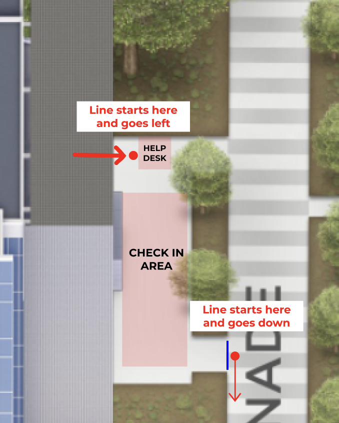
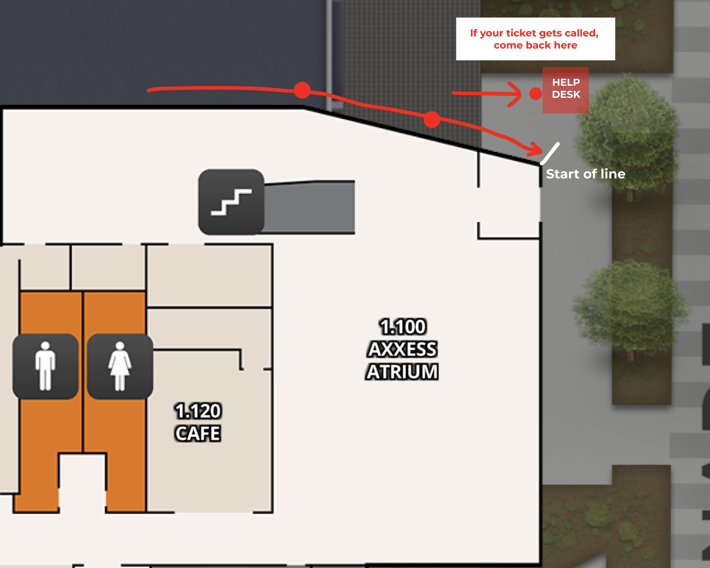
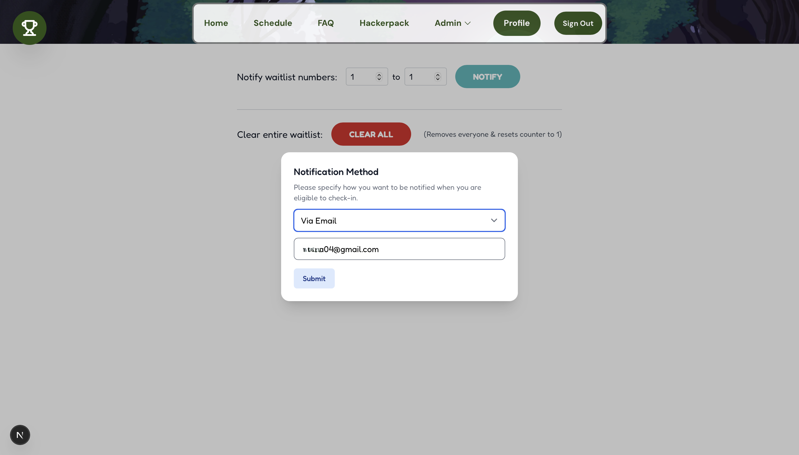
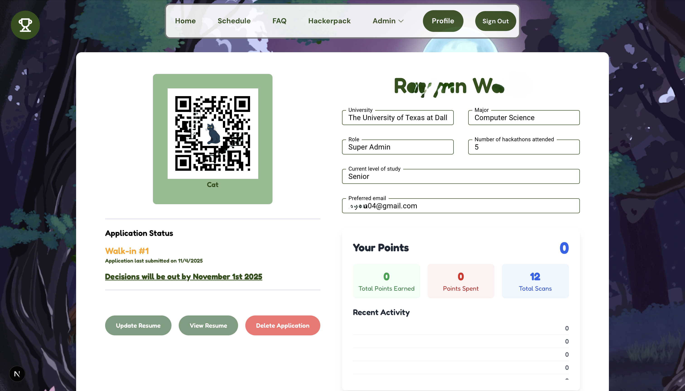
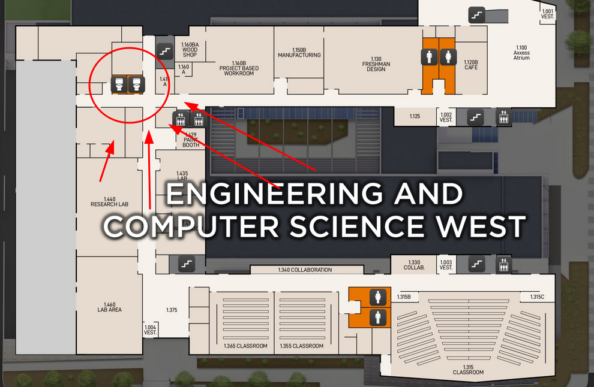

## 🚗 Parking

Parking Passes can be found here:
**[Venue Parking and Rooms](venue-parking.md)**

---

## 🛎️ Check-in Process

We will be checking in at the **area in front of ECSW starting at** **8 AM**. This is for people who have have been accepted. You will need your:

- Driver's License or Student ID
- QR Code from the **[legend.hackutd.co](https://legend.hackutd.co)** site

Here's a map for reference:

You need to checked-in by **10:00 AM**. If you aren’t checked-in by then, **your spot may be given away**, so make sure to show up by then.

:::info
If you have any issues with your QR Code or account, please make your way to the tech help desk shown in the map above.
:::

Think you might be late? Check out **[Late Check-in](#late-check-in)**

---

## 🚶‍♀️ Walk-ins

We will still be allowing walk-ins on a **first-come, first-served basis** on the day of the event. We start handing out tickets to walk-ins **starting at 6:00 AM** on Saturday, November 8th by **ECSW**. Spots are limited, so be sure to arrive early to secure your place. Once you get your walk-in ticket, you do not need to stay near ECSW. At **10:00 AM**, we will **start calling ticket numbers** to be let in, so make sure you’re back by then. Be on the lookout for a text message as well!
:::note
Please stand in line at ECSW to receive your walk-in ticket. At 10:00 AM, **depending on availability**, we will be notifying walk-ins and if you're number is called, you can go to ECSW to join the check-in line and complete the [**check-in process**](#️-check-in-process).
:::

When you get to the front of the Walk-in line, you will choose to either be notified via text message or email. You will need your student ID or driver's license to verify your identity when you are called.

After choosing your notification method, you will be able to view your waitlist number by logging into [legend.hackutd.co](https://legend.hackutd.co) with the same method you used to sign up for the hackathon.

---

## Late Check-in

If you can't make it to check-in by 10:00 AM for one of the following reasons, you may email [hello@hackutd.co](mailto:hello@hackutd.co):

- Flight delays
- Car troubles
- Other valid travel issues

Refer to the **[Travel Guide](travel-guide.md)** if you are arriving late due to you traveling in

---

## 👾 Discord

Join the Discord for **announcements**, **team-building**, general discussion with fellow hackers, help from **mentors**, and contacting **sponsors**:

Join the HackUTD: Lost In The Pages **[Discord Server!](https://discord.gg/DVy4xdG57s)**

---

## 🎓 Need a Mentor?

Refer to the **[Mentor Guide](mentor-guide.md)** for instructions on how to request a mentor through Discord.

---

## 🌐 Wi-Fi

- If you are a UTD student, simply connect to **CometNet** for the best connection.
- If you are NOT a UTD student, you should connect to the Wi-Fi called **HackUTD**. The **HackUTD** Wi-Fi will prompt you to sign in through your browser.
- We also have a guest wifi (**UTDGuest**), but it has issues with blocking specific ports and operations such as _git push_, _MongoDB Atlas connections_.

---

## 🥪 Meals

| **Meal**                      | **Restaurant**    | **Time**          | **Location**   |
| ----------------------------- | ----------------- | ----------------- | -------------- |
| Saturday Lunch                | Banana Leaf       | 12:00pm - 1:30pm  | ECSW Courtyard |
| Saturday Dinner               | Little Rome       | 7:30pm - 9:30pm   | ECSW Atrium (1st Floor)    |
| Midnight Snack                | Mystery           | 11:30pm - 12:00am | ECSW Atrium (1st Floor)    |
| Sunday Breakfast              | 85 Degrees Bakery | 9:00am - 10:00am  | ECSW Atrium (1st Floor)    |
| Sunday Breakfast Refreshments | Mystery           | 8:00am - 11:00am  | ECSW Courtyard |
| Sunday Lunch                  | Modern Market     | 12pm - 1pm        | ECSW Atrium (1st Floor)    |

### 🫒Allergen Menu

TBD

---

## 🖥️ Hacker Spaces (Maps)

> **You can find hacker rooms here: [Venue Parking and Rooms](venue-parking.md)**

## 😴 Sleeping Rooms/Showers

- Sleeping rooms: **2.325**, **4.325**
  - These will open after midnight snack at 12:30AM on Sunday!
  - Hackers occupying these rooms will be asked to move!
- Showers (single occupancy bathrooms): Back corner on **1st floor**
  - We will provide shampoo, conditioner, and body wash, but you will have to bring your own towel and shower shoes!

---

# 🔍 Workshops

### Sponsor Workshops

Note that all of these workshops are held on Saturday except for "How to Pitch your Project" by HackUTD, which will be held on Sunday morning!

:::warning
Incomplete
:::

| **Workshop**                                                 | **Company**   | **Time**        | **Location** |
| ------------------------------------------------------------ | ------------- | --------------- | ------------ |
| **[AI-Powered Product Management: A Day in the Life, Reimagined](workshops/pnc.md)** | PNC           | 1:00pm - 1:45pm | ECSW 1.315   |
| **[Pitch to Win](workshops/t-mobile.md)**                    | T-Mobile      | 1:55pm - 2:35pm | ECSW 1.315   |
| **[TBD](workshops/goldman-sachs.md)**                        | Goldman Sachs | 2:45pm - 3:30pm | ECSW 1.355   |
| **[AI, APIs, and the Future of Building Fast](workshops/statefarm.md)** | StateFarm     | 3:40pm - 4:25pm | ECSW 1.355   |
| **[Infrastructure Decoded: The Anatomy of HPC Data Centers](workshops/nmc.md)** | NMC           | 4:35pm - 5:20pm | ECSW 1.355   |
| **[Intro to React Development: Your First Web Application](workshops/eog.md)**                                  | EOG           | 5:30pm - 6:15pm | ECSW 1.355   |

### Other Workshops

| **Workshop**                       | **Company** | **Time**                   | **Location** |
| ---------------------------------- | ----------- | -------------------------- | ------------ |
| TBD                                | MLH         | 6:30pm - 7:10pm            | ECSW 1.355   |
| Networking Bingo — Chill & Connect | WEHACK      | 7:30pm - 8:30pm           | ECSW 1.355   |

---

# 🎨 Fun Events

### Saturday

| **Event** | **Time** | **Location** |
| --------- | -------- | ------------ |
| 💪 **Team Building** Come find teammates! | 12:30–1:00 PM | ECSW 1.355 |
| 🍹 **Tavern Mocktail** Come try our drinks! | 2:00–6:00 PM | ECSW Bird's Nest (2nd Floor) |
| 👩‍💻 **Typing Competition** Show off your typing skills! | 7:00–7:30 PM | ECSW 1.365 |
| 📐 **Estimathon** How well can you estimate? | 8:00–9:00 PM | ECSW 1.365 |
| 🎤 **Karaoke** Sing your heart out! | 9:30–10:30 PM | ECSW 1.365 |
| 🤝 **Hackathon Organizer Meetup** For Hackathon Organizers Only | 10:30–11:30 PM | ECSW 1.365 |

### 🌙 Late Night Events

| **Event** | **Time** | **Location** |
| --------- | -------- | ------------ |
| 🌘 **Midnight Snack** Come by for some free snacks! | 11:30 PM–12:00 AM | ECSW Atrium (1st Floor) |
| ⭐ **Presented by PNC: HackUTD Olympics** Compete in funny team games to win the grand prize! | 12:00–1:00 AM | ECSW 1.315 |
| 🍜 **Tavern Ramen Bar** Customize your own ramen bowl! | 12:00–2:00 AM | ECSW Bird's Nest (2nd Floor) |
| 🎬 **World's Watch Party (LEAGUE OF LEGENDS)** Enjoy the League of Legends Worlds Finals with fellow hackers! | 2:00–4:00 AM | ECSW 1.365 |

### Sunday

| **Event** | **Time** | **Location** |
| --------- | -------- | ------------ |
| 🐶 **Dog Petting Zoo** Come pet some dogs to start your day! | 9:00–11:00 AM | ECSW 2.325 |
| 🏪 **Tavern Shop** Come check out our merchandise before we close up forever! | 4:15–4:45 PM | ECSW Bird's Nest (2nd Floor) |

---

# 🧑‍⚖️ Submission and Judging

Refer to the **[Submission and Judging Guide](judge-guide.md)** for more information on how to submit your project and how judging will work!

---

# ❓Help

The **info desk** will be located on the **1st floor Atrium of ECSW**, near the big green staircase. We have organizers there at all times during the event if an issue, question, or anything comes up. Please feel free to stop by and ask for help!

---

# ℹ️ Other Info

**[Venue Parking and Rooms](venue-parking.md)**

**[Travel Guide](travel-guide.md)**

**[Prizes/Challenge Statements](prizes-challenges.md)**

**[HackUTD Lost in the Pages: Guided Project](/guided-project/)**
