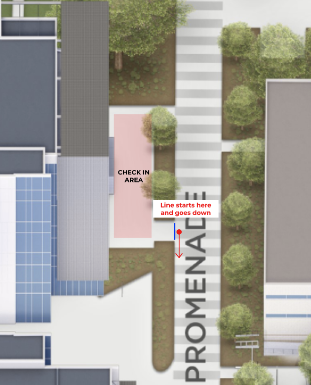
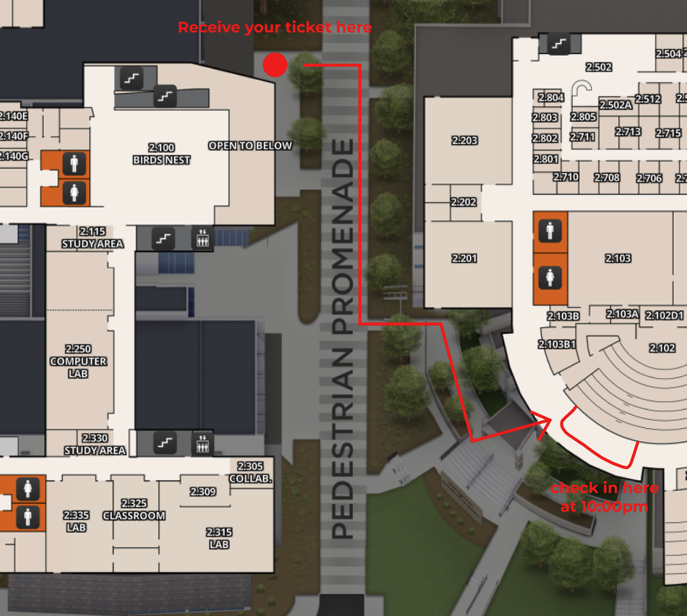

## 🚗 Parking

Parking Passes can be found here:
**[Venue Parking and Rooms](venue-parking.md)**

---

## 🛎️ Check-in Process

We will be checking in at the **area in front of ECSW starting at** **8 AM**. This is for people who have QR codes from registration. You will need your:

- Driver's License or Student ID
- QR Code from the **[legend.hackutd.co](https://legend.hackutd.co)** site

Here's a map for reference:

You need to checked-in by **10:00 AM**. If you aren’t checked-in by then, **your spot may be given away**, so make sure to show up by then.

**_If you do not have a QR code, you have not been accepted. If you still want to attend you can try you luck at walk-ins._**

Think you might be late? Check out **[Late Check-in](#late-check-in)**

---

## 🚶‍♀️ Walk-ins

We will still be allowing walk-ins on a **first-come, first-served basis** on the day of the event. We start handing out tickets to walk-ins **starting at 6:00 AM** on Saturday, November 8th by **ECSW**. Spots are limited, so be sure to arrive early to secure your place. Once you get your walk-in ticket, you do not need to stay near ECSW. At **10:00 AM**, we will **start calling ticket numbers** to be let in, so make sure you’re back by then. Be on the lookout for a text message as well!
:::warning
Please stand in line at ECSW to receive your walk-in ticket, but come back at 10:00 AM to ECSS to complete the process.
:::

---

## Late Check-in

If you can't make it to check-in by 10:00 AM for one of the following reasons, you may email [hello@hackutd.co](mailto:hello@hackutd.co):

- Flight delays
- Car troubles
- Other valid travel issues

Refer to the **[Travel Guide](travel-guide.md)** if you are arriving late due to you traveling in

---

## 👾 Discord

Join the Discord for **announcements**, **team-building**, general discussion with fellow hackers, help from **mentors**, and contacting **sponsors**:

Join the HackUTD: Lost In The Pages **[Discord Server!](https://discord.gg/DVy4xdG57s)**

---

## 🎓 Need a Mentor?

Refer to the **[Mentor Guide](mentor-guide.md)** for instructions on how to request a mentor through Discord.

---

## 🌐 Wi-Fi

- If you are a UTD student, simply connect to **CometNet** for the best connection.
- If you are NOT a UTD student, you should connect to the Wi-Fi called **HackUTD**. The **HackUTD** Wi-Fi will prompt you to sign in through your browser.
- We also have a guest wifi (**UTDGuest**), but it has issues with blocking specific ports and operations such as _git push_, _MongoDB Atlas connections_.

---

## 🥪 Meals

| **Meal**                      | **Restaurant**    | **Time**          | **Location**   |
| ----------------------------- | ----------------- | ----------------- | -------------- |
| Saturday Lunch                | Banana Leaf       | 12:00pm - 1:30pm  | ECSW Courtyard |
| Saturday Dinner               | Little Rome       | 7:30pm - 9:30pm   | ECSW Atrium    |
| Goldman Sachs Drink Drop      | Mystery           | 9:30pm - TBD      | ECSW Courtyard |
| Midnight Snack                | Mystery           | 11:30pm - 12:00am | ECSW Atrium    |
| Sunday Breakfast              | 85 Degrees Bakery | 9:00am - 10:00am  | ECSW Atrium    |
| Sunday Breakfast Refreshments | Mystery           | 8:00am - 11:00am  | ECSW Courtyard |
| Sunday Lunch                  | Modern Market     | 12pm - 1pm        | ECSW Atrium    |

### 🫒Allergen Menu

TBD

---

## 🖥️ Hacker Spaces (Maps)

> **You can find hacker rooms here: [Venue Parking and Rooms](venue-parking.md)**

## 😴 Sleeping Rooms/Showers

- Sleeping rooms: **2.325**, **4.325**
  - These will open after midnight snack at 12:30AM on Sunday!
  - Hackers occupying these rooms will be asked to move!
- Showers (single occupancy bathrooms): Back corner on **1st floor**
  img tbd

---

# 🔍 Workshops

### Sponsor Workshops

Note that all of these workshops are held on Saturday except for "How to Pitch your Project" by HackUTD, which will be held on Sunday morning!

:::warning
Incomplete
:::

| **Workshop**                                                 | **Company**   | **Time**        | **Location** |
| ------------------------------------------------------------ | ------------- | --------------- | ------------ |
| AI-Powered Product Management: A Day in the Life, Reimagined | PNC           | 1:00pm - 1:45pm | ECSW 1.315   |
| TBD                                                          | T-Mobile      | 1:55-2:35       | ECSW 1.315   |
| TBD                                                          | Goldman Sachs | 2:45pm - 3:30pm | ECSW 1.355   |
| AI, APIs, and the Future of Building Fast                    | StateFarm     | 3:40pm - 4:25pm | ECSW 1.355   |
| Infrastructure Decoded: The Anatomy of HPC Data Centers      | NMC           | 4:35pm - 5:20pm | ECSW 1.355   |
| TBD                                                          | EOG           | 5:30pm - 6:15pm | ECSW 1.355   |

### Other Workshops

| **Workshop**                       | **Company** | **Time**                   | **Location** |
| ---------------------------------- | ----------- | -------------------------- | ------------ |
| TBD                                | MLH         | 8:30pm - 9:10pm            | ECSW 1.355   |
| Networking Bingo — Chill & Connect | WEHACK      | 9:30pm - 10:10pm           | ECSW 1.355   |
| How to Pitch your Project          | HackUTD     | Nov 9th: 10:00am - 10:40am | ECSW 1.355   |

---

# 🎨 Fun Events

### Saturday

- 💪 **Team Building** — _12:30–1:00 PM @ ECSW 1.355_  
  Come find teammates!
- 🍹 **Tavern Mocktail** — _2:00–6:00 PM @ ECSW Bird's Nest (2nd Floor)_  
  Come try our drinks!
- 👩‍💻 **Typing Competition** — _7:00–7:30 PM @ ECSW 1.365_  
  Show off your typing skills!
- 📐 **Estimathon** — _8:00–9:00 PM @ ECSW 1.365_  
  How well can you estimate?
- 🎤 **Karaoke** — _9:30–10:30 PM @ ECSW 1.365_  
  Sing your heart out!
- 🤝 **Hackathon Organizer Meetup** — _10:30–11:30 PM @ ECSW 1.365_  
  For Hackathon Organizers Only

---

### 🌙 Late Night Events

- 🌘 **Midnight Snack** — _12:00–12:30 AM_  
  Come by for some free snacks!
- ⭐ **Presented by PNC: HackUTD Olympics** — _12:00–1:00 AM_@ ECSW 1.315  
  Compete in funny team games to win the grand prize!
- 🍜 **Tavern Ramen Bar** — _12:00–2:00 AM @ ECSW Bird's Nest (2nd Floor)_  
  Customize your own ramen bowl!
- 🎬 **World's Watch Party (LEAGUE OF LEGENDS)** — _2:00–4:00 AM @ ECSW 1.365_  
  Enjoy the League of Legends Worlds Finals with fellow hackers!

---

### Sunday

- 🐶 **Dog Petting Zoo** — _9:00–11:00 AM_  
  Come pet some dogs to start your day!
- 🏪 **Tavern Shop** — _4:15–4:45 PM_  
  Come check out our merchandise before we close up forever!

---

# 🧑‍⚖️ Submission and Judging

Refer to the **[Submission and Judging Guide](judge-guide.md)** for more information on how to submit your project and how judging will work!

---

# ❓Help

The **info desk** will be located on the **1st floor Atrium of ECSW**, near the big green staircase. We have organizers there at all times during the event if an issue, question, or anything comes up. Please feel free to stop by and ask for help!

---

# ℹ️ Other Info

**[Venue Parking and Rooms](venue-parking.md)**

**[Travel Guide](travel-guide.md)**

**[Prizes/Challenge Statements](prizes-challenges.md)**

**[HackUTD Lost in the Pages: Guided Project](/guided-project/)**
