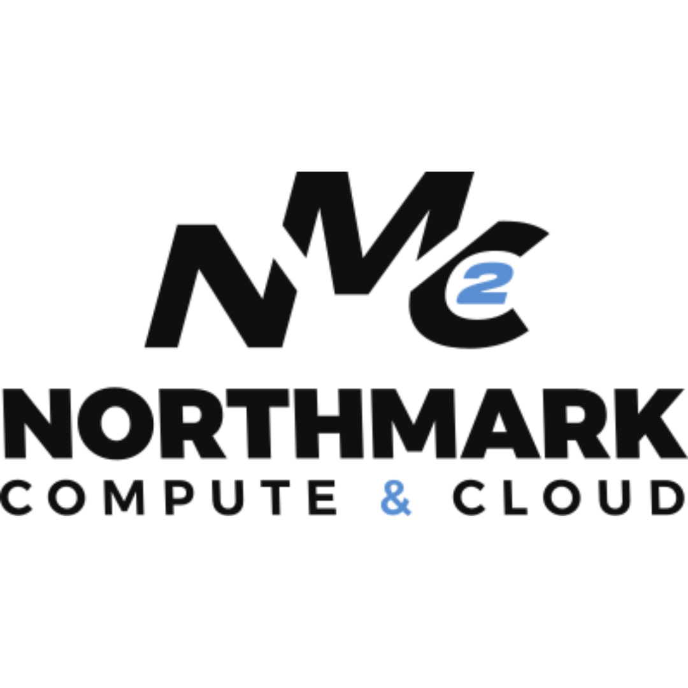
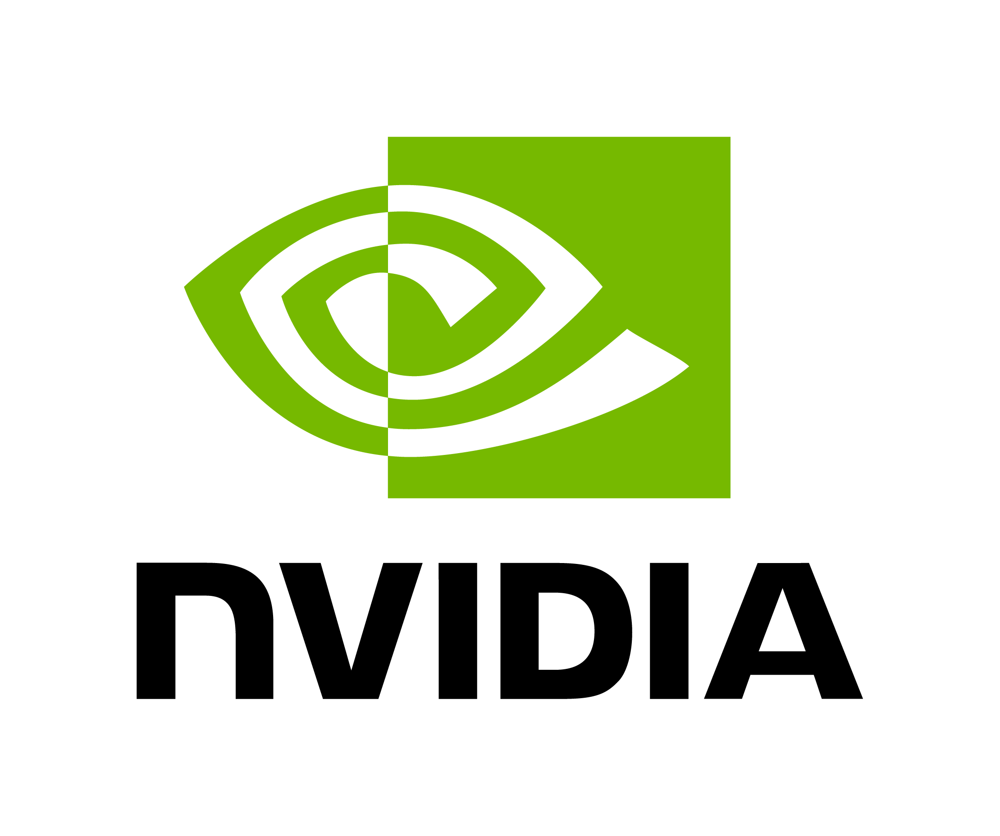

## Prize distribution

Unless otherwise stated, each member of a winning team will receive the same prize. Sponsors will bring four copies of each prize; if a team has more than four members, organizers will coordinate alternative arrangements.

1. [Sponsor Challenges](#sponsor-challenges--prizes)
2. [General Prizes](#general-prizes)

## Sponsor Challenges & Prizes

---

### PNC

#### Challenge

We challenge you to design an AI-powered 
productivity solution for Product Managers.

The solution should reimagine how artificial intelligence can be embedded across the product lifecycle to help Product Managers make better decisions, accelerate speed to market, and scale effectively in a complex, highly regulated industry.

Your solution could support Product Managers in areas such as: 
Product Strategy & Ideation: Brainstorming, market sizing, scenario planning, and aligning customer needs with business goals. 
Requirements & Development: Drafting user stories, acceptance criteria, and backlog grooming with AI-assisted clarity and prioritization.
Customer & Market Research: Synthesizing customer feedback, competitor activity, and industry trends into actionable insights.
Prototyping & Testing: Generating wireframes, mockups, or test cases and iterating with synthetic or real user feedback.
Go-to-Market Execution: Assisting in persona development, Go-to-Market (GTM) strategy, release notes, and stakeholder communication.
Automation & Intelligent Agents: Automating repetitive Product Manager workflows such as sprint planning, reporting, and cross-team updates.

#### Prizes
1st: PlayStation 5 Slim

2nd: Ray-ban Meta AI Sunglasses

3rd: Yaber T1 Pro-Mini Smartphone Projector

---

### T-Mobile

#### Challenge

Build the T-Mobile Customer Happiness Index — a real-time, data-driven solution that captures how customers feel about T-Mobile. Engineer a system that streams live sentiment, feedback, and network data to detect issues before they spread, highlight moments of delight, and empower teams to enhance the customer experience. Use your skills in data engineering, APIs, analytics, and visualization to turn customer emotion into actionable insight.

#### Prizes
1st: iPhones

2nd: iPads

3rd: Beats Earbuds

---

### StateFarm

#### Challenge

In this 24-hour hackathon challenge, build a tool that compares responses from two versions of a service by sending the same request to both and identifying any differences in their outputs. You will design and implement your own example service and front end as needed.

The service should support operations such as creating and retrieving data, with input and output structured in JSON. Some differences between versions—like generated IDs during creation—are expected and should be flagged as acceptable. Unexpected differences, such as mismatched fields or error statuses, indicate potential issues.

Your tool must perform a deep comparison of the responses, clearly reporting all discrepancies while distinguishing expected from unexpected differences. Provide a concise summary highlighting any regressions or inconsistencies.

This challenge tests your ability to design, implement, and validate service behavior across versions, ensuring smooth evolution and reliable upgrades.

#### Prizes
1st: HOVERair X1 Drone w/Camera

2nd: Bose Earbuds 

3rd: Newsmy Portable Power Station 

---

### Goldman Sachs

#### Challenge

Problem Statement:

Traditional vendor and client onboarding processes are often manual, fragmented, and prone to inefficiencies, leading to significant delays, increased operational costs, and heightened security risks. These processes frequently lack robust privilege management, making it difficult to enforce the baseline control requirements. Furthermore, the absence of integrated fraud detection mechanisms during onboarding exposes organizations to financial losses and reputational damage from fraudulent entities or activities. A unified, intelligent solution is needed to streamline these critical business functions while bolstering security and compliance.

Solution Overview:

The challenge is to develop a ""Secure & Intelligent Onboarding Hub"" – a comprehensive platform that automates and secures the entire lifecycle of vendor and client onboarding. This solution should integrate control requirements and advanced fraud detection capabilities, leveraging AI/ML to enhance efficiency and security. 
 

Components to Consider Building:

Onboarding portal to submit the required information for onboarding and reviews for vendors/clients via dynamic UI forms.
Automated workflow engine to manage the onboarding process, verification, approvals, dynamic routing based on the assessments.
Security assessment module to validate compliance with the baseline security controls requirements based on the type of the vendor/client including but not limited to identity and access management, encryption, logging/monitoring, network security, etc.
Privacy module to identify involvement of any personal data (PII) during or after the onboarding process, flag it accordingly and provide a masking solution where feasible. 
Fraud detection and risk scoring module for real-time monitoring, scoring and alerting based on the behavioral patterns and data.
Audit and Reporting dashboard for administrators to monitor onboarding progress and for leadership to get overall metrics.

Sample Datasets/Resources

Kaggle's vendor/client management datasets
Supplier datasets on data.gov
Public marketplace onboarding processes "

#### Prizes
1st: Apple Airpod Pros 3

2nd: Apple TV

3rd: $50 Grub Hub gift card

---

### Toyota Financial Services

#### Challenge

Toyota’s global vision is to lead the future of mobility, enriching lives around the world with the safest and most responsible ways of moving people. 
 
Toyota is the leader in making some of the best-selling, fuel efficient and top-quality automobiles in the world. As part of the hackathon, develop a web or mobile solution that helps people to easily shop for Toyota’s vehicles by searching, comparing, and finding their dream cars based on several personal preferences including costs to finance and/or lease a vehicle.

#### Prizes

1st: $500 Amazon Gift Card

2nd: $350 Amazon Gift Card

3rd: $150 Amazon Gift Card

---

### Northmark Compute & Cloud (NMC^2)

#### Challenge

NMC² operates several data centers around the globe including a $2.8 billion high performance compute facility powering 400MW of compute. Data center technicians keep these massive computing facilities running 24/7 however their day-to-day work is full MCof challenges such as complex workflows, varied environments, and endless work orders that demand attention. Build a solution that helps technicians stay efficient, safe, and effective. We're looking for creative solutions that bring a fresh perspective and we encourage hackers to think outside of the box.
Prizes: I’ve put in a request and am currently awaiting approval from HR leadership.

#### Prizes

1st place will choose first, followed by 2nd and 3rd. The prizes are as follows:

- Nintendo Switch 2
- Sony WH-1000XM5 Headphones
- DJI Tello Drones

---

### Capital One

#### Challenge

Our track is The Best Financial Hack! This is your chance to change the game in fintech. Whether it's an innovative payment solution, helping consumers shop smarter, making financing more accessible, or a creative way to improve financial literacy, we want to see your boldest ideas in action. The track is intentionally vague to let you bring your own creativity to it!

#### Prizes

1st: $300 Amazon Gift Card

---

### NVIDIA

#### Challenge

NVIDIA is excited to sponsor HackUTD this year, inviting teams to build with NVIDIA Nemotron and push beyond basic chatbots. The challenge focuses on intelligent agents capable of planning and executing multi-step workflows, integrating external tools and APIs, and solving real-world problems with meaningful impact. Participants will explore how AI can take action, not just respond; opening pathways to automation, research acceleration, creative production, and more.

Projects must demonstrate:
- Reasoning beyond single-prompt conversation
- Workflow orchestration across steps or services
- Tool and API integration for data or task execution
- Clear practical value and applicability

 
Top teams will compete for NVIDIA prizes, including RTX 5080 GPUs, NVIDIA backpacks, merch, and Brev credits to continue prototyping. Whether you’re new to agentic AI or already building autonomous systems, this is your chance to shape what’s next.
 
Build. Iterate. Execute. Let’s see what you create."

#### Prizes

1st: 3 RTX 5080 GPUs 3 NVIDIA Logo Hats

2nd: 2 RTX 5080 GPUs 3 NVIDIA Backpacks 3 $100 Brev Credits

3rd: 3 NVIDIA Backpacks 3 $200 Brev Credits

---

### CBRE

#### Challenge

[CBRE Challenge Statement](https://drive.google.com/file/d/1BJzW39HkAO-Sf-2V-Ix6BLsQtjigrnqH/view?usp=share_link)

#### Prizes

1st: $250 Amazon Gift Card

2nd: $150 Amazon Gift Card

3rd: $75 Amazon Gift Card

---

### EOG

#### Challenge
CauldronWatch: The Potion Flow Monitoring Challenge

Deep within Poyo’s Potion Factory, dozens of enchanted cauldrons bubble away, collecting potions from brewing towers spread across the facility. Each cauldron fills at its own pace before courier witches swoop in to haul the precious brews to the Enchanted Market. Every collection is logged using Potion Transport Tickets detailing how much potion was collected and when the journey finished.

But lately, something’s amiss! Potion volumes don’t quite match the transport tickets, and rumors of unlogged potion drains are spreading through the halls.

Your task is to develop a real-time Potion Flow Monitoring Dashboard that tracks potion levels across all cauldrons, identifies collection events, and checks the Potion Transport Tickets to detect any missing or unlogged potion. The system should automatically flag inconsistencies, identify suspicious activity, and help ensure every drop of potion is properly accounted for.

You’ll receive historical and real-time cauldron level data, Potion Transport Ticket records, and a map of the potion network linking each cauldron to the Enchanted Market. Use these to visualize the entire operation, monitor live potion flows, and test your real-time detection logic.

✨ Bonus: Extend your system to forecast brew levels and optimize courier routes — helping witches plan efficient pickup schedules, prevent cauldron overflows, and keep the potion trade flowing smoothly across the realm. hackutd2025.eog.systems

#### Prizes

1st: Nintendo Switch 2

2nd: Ninja Cremi

---

## Need help?

If you're unsure which challenge to pick or want to clarify something about the challenge, visit the sponsor's channel in the discord or their booth if they are available.

---

## General Prizes

### 1st Place Prize: Mac M4 16GB

### 2nd Place Prize: iPad 11" A16 + Apple Pencil 2nd Gen (USB-C)

### 3rd Place Prize: Lofree FlowLite 84 Keyboard

### Best Startup: Phillips Hue Light Bar

### Best Hardware: ELEGOO UNO Project Starter Kit

### Best Design: Fujifilm Instax Mini SE Instant Camera with Bonus 10 pack Mini Film

### Best Beginner: Anker Power Bank

### Best Guided Track: Nord VPN 1 year subscription