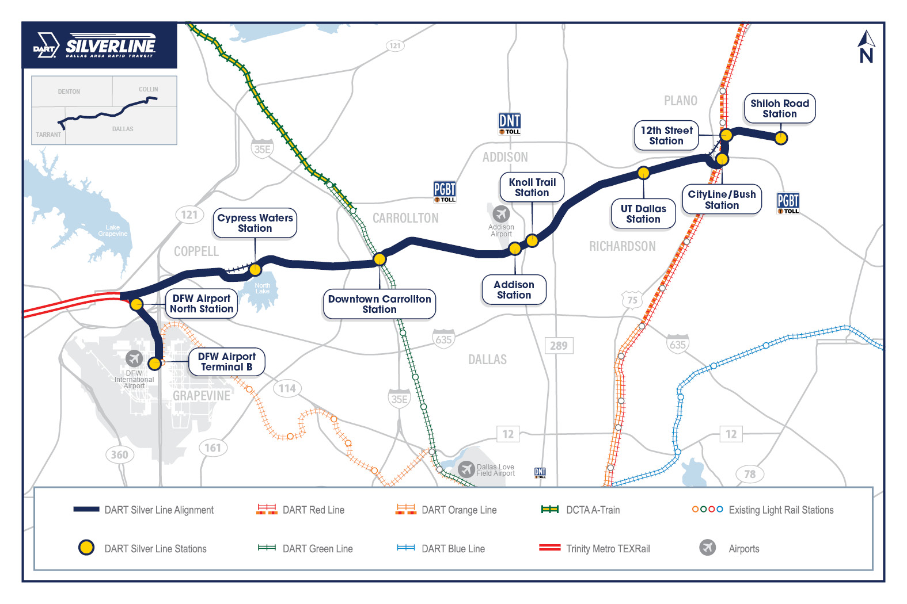

## ⏱️ Running Late? Flight delayed? Car battery died?

If you have a valid reason for checking in late, you can email [hello@hackutd.co](mailto:hello@hackutd.co)

---

## ⛅ Weather

This weekend, we're expecting lows of 60°F (15°C) and highs of 80°F (27°C) so pack accordingly!

## 🧳 Packing List

- 🚿 Towel & clothes to change into (yes, we have showers!!!)
- 🧥 LAYERS (Jackets, pants, etc) - the building can get cold and it can also get windy!
- 😴 Blanket/Pillow - there will be sleeping rooms if you need somewhere quiet
- 🪥Toiletries
- 💻 Laptop, chargers
- 📄 Travel documents (driver’s license, student ID) /
- ☂️ Umbrella - It doesn't look like it's gonna rain, but you never know ¯\\\_(ツ)\_/¯

---

## ✈️ Airport to UTD

Arriving at either DFW International Airport or Love Field Airport, you have 3 options:

- Uber/Lyft - ~$35 for Lyft, ~$25 for Uber, a ~30 minute commute
  - Uber’s rates drop significantly if you walk a little ways from the airport (for ex. take an Uber from Belt Line DART Station)
- Train/Bus - a 2hr, $3-6 commute
    1. Public transportation only runs between 5am to midnight!
    2. Download the GoPass app and buy an AM, PM, or day pass
    3. Click the Plan tab (bottom left) and navigate to UTD or just use [Google Maps](https://www.google.com/maps/dir/DFW+International+Airport,+2400+Aviation+Dr,+DFW+Airport,+TX+75261/University+of+Texas+at+Dallas,+West+Campbell+Road,+Richardson,+TX/@32.8913835,-96.9523579,12z/data=!4m14!4m13!1m5!1m1!1s0x864c2a660d222aa7:0x73323f5e067d201c!2m2!1d-97.0403352!2d32.8998091!1m5!1m1!1s0x864c21ff895e4aa5:0xd9098b32e9aa1331!2m2!1d-96.7502474!2d32.9856974!3e3?entry=ttu)
- Find a friend to pick you up - it’ll be better than the first two options!

This is a map route from DFW to UTD using public transportation:

---

## 🗺️ Venue Information

The venue is called ECSW.

**[Erik Jonsson School of Engineering and Computer Science West Building (ECSW)](https://maps.app.goo.gl/L1rpBD6F2keaLEGt6)**

A few things to note:

- It will be low 70°F (20-25°C) inside, which can get chilly for some people!
- The venue will have showers!! 🚿
- There will be sleeping rooms!! 😴

If you’re looking for the venue address, parking, or interior map, check out:

**[Venue Parking and Rooms](venue-parking.md)**

