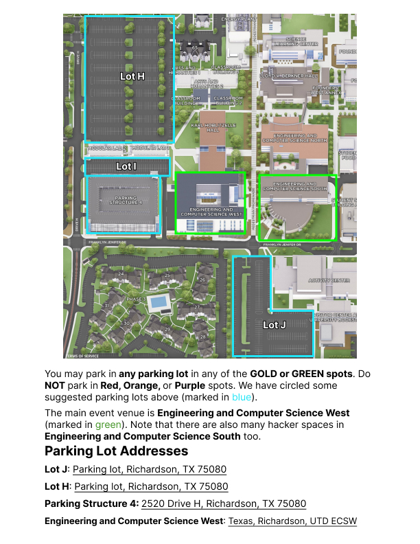
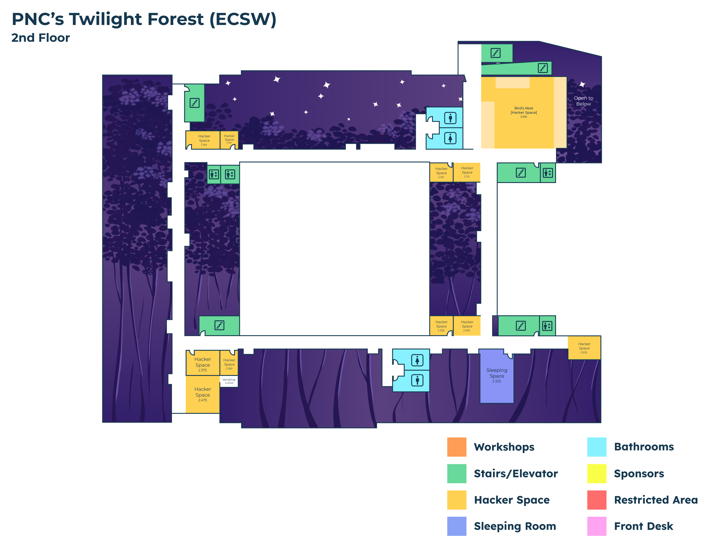
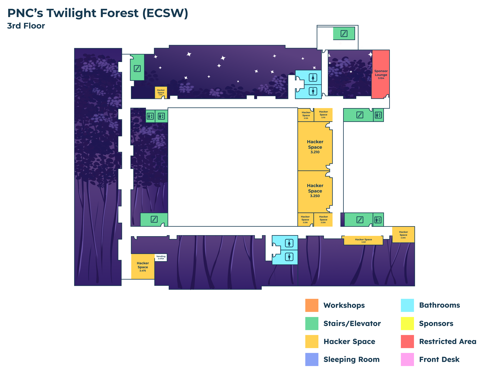
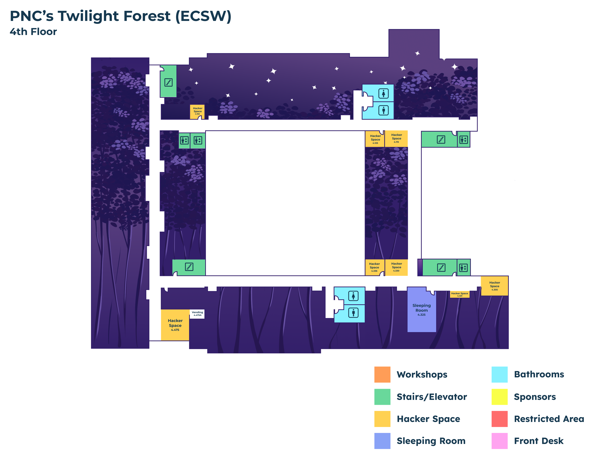
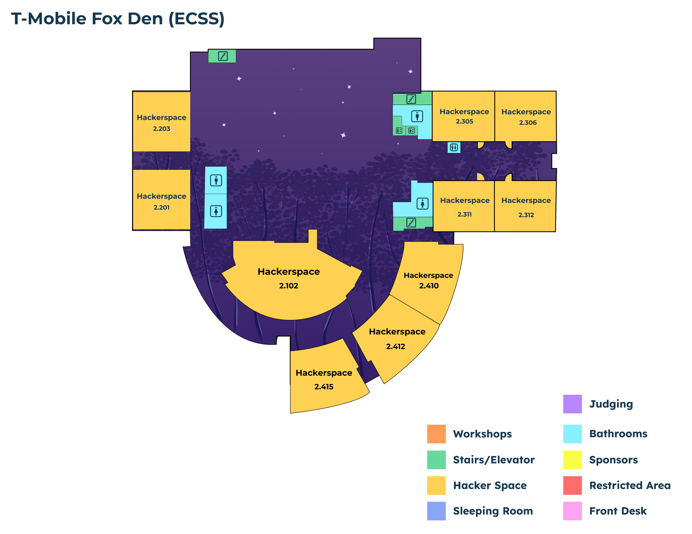
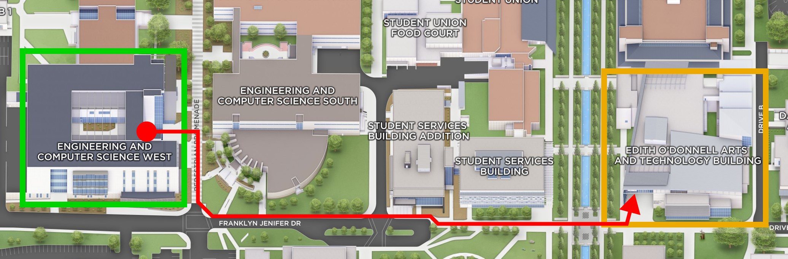

## Parking Permit

Non-UTD students will need a parking permit to park at UTD during HackUTD. Please download and print the permit below, and place it on your dashboard so it is clearly visible.

# **Gold Permit (PDF)**

---

## Venue address

**[Erik Jonsson School of Engineering and Computer Science West Building (ECSW)](https://maps.app.goo.gl/L1rpBD6F2keaLEGt6)**

### At a glance

- Permit required — print the permit and place it on your dashboard.
- Allowed parking colors: Green and Yellow/Gold.
- Do NOT park in Purple or Orange spots.
- Overnight parking is NOT allowed in Parking Structure 4.
- We will have permits available at the info desk, but please print yours in advance.

### Before you arrive

1. Download and print the parking permit
2. Place the permit on your dashboard so it is clearly visible.
3. Park only in Green or Yellow/Gold zones.
4. Do not leave your car overnight in Structure 4.

---

## Parking Locations

### Parking Lot Addresses (Hyperlinked to Google Maps)

**[Parking Lot J](https://google.com/maps/place/Parking+Lot+J/@32.9832153,-96.7629778,5084m/data=!3m1!1e3!4m6!3m5!1s0x864c2100023d4a19:0xf96c48a1b1114462!8m2!3d32.9844725!4d-96.7504943!16s%2Fg%2F11x0pwn3pl?entry=ttu&g_ep=EgoyMDI1MTAyMC4wIKXMDSoASAFQAw%3D%3D)**

**[Parking Lot H](https://www.google.com/maps/place/Lot+H,+Richardson,+TX+75080/@32.9876998,-96.7555914,1271m/data=!3m2!1e3!4b1!4m6!3m5!1s0x864c2201c720b551:0x54b136ce6c0cf575!8m2!3d32.9875159!4d-96.7530794!16s%2Fg%2F11bvtdzw2v?entry=ttu&g_ep=EgoyMDI1MTAyMC4wIKXMDSoASAFQAw%3D%3D)**

**[Parking Structure 4](<https://www.google.com/maps/place/UTD+Parking+Structure+4+(PS4)/data=!4m2!3m1!1s0x0:0x70b6d83d8e817538?sa=X&ved=1t:2428&ictx=111>)**

**[Erik Jonsson School of Engineering and Computer Science West Building (ECSW)](https://www.google.com/maps?sca_esv=5314ac5036c6a181&output=search&q=utd+ecsw&source=lnms&fbs=AIIjpHxU7SXXniUZfeShr2fp4giZ1Y6MJ25_tmWITc7uy4KIeqDdErwP5rACeJAty2zADJgKwqE9vE8G6XUjedIRSWZu1w-EyDQQzBO-FgE4jMyjIL2plRuFzCUX70RenpxRX1DvOnyfz4JbbC6ExazGRZzR6KfDSV1-QrzLVxFGWkv5fvPG3AGgqozC2ceOYFrQbQdAFrfRzitLYjQDYjpSQGcQ7NflLQ&entry=mc&ved=1t:200715&ictx=111)**

---

## Venue Interior Maps

---
---

---

## Getting to Opening Ceremony

From ECSW (GREEN) walk to ATEC (GOLD) building for the Opening Ceremony. Follow the campus signs or the route on the map above.

