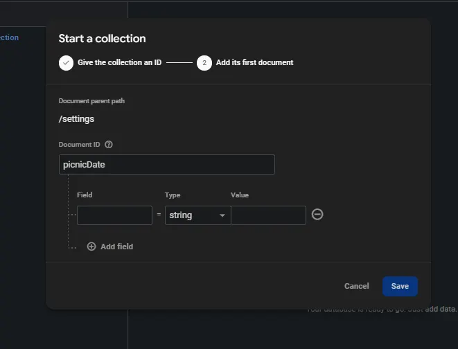
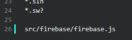

### What is a Backend? ###
In web and app development, a backend is like the behind-the-scenes engine that powers your application. It's the part of the software that users don't directly interact with, but it's crucial for making everything work smoothly. Here's a simple breakdown:
- **Data Storage**: The backend is where all the data for your app is stored and managed. This could be user profiles, posts, or any other information your app needs to remember.
- **Processing**: It handles all the complex calculations and logic that your app needs to function. For example, if you're using a social media app, the backend would process things like showing you posts from your friends.
- **Security**: The backend is responsible for keeping user data safe and ensuring that only authorized users can access certain parts of the app.
- **APIs**: It provides ways for the frontend (what users see and interact with) to communicate with the backend, usually through something called an API (Application Programming Interface).  

Think of it like a restaurant: The backend is the kitchen where all the food is prepared, while the frontend is the dining area where customers sit and enjoy their meals.

## What is Firebase?

Firebase is a popular backend-as-a-service (BaaS) platform developed by Google. It provides a set of tools and services that make it easier for developers to create and manage the backend for their applications. Here's what makes Firebase special:

- **Easy to Use:** Firebase is designed to be beginner-friendly, allowing developers to set up a backend quickly without needing to manage servers or write complex backend code.
- **Real-time Database:** It offers a real-time database that automatically syncs data across all connected devices, making it great for apps that need live updates.
- **Authentication:** Firebase provides built-in user authentication services, making it easy to implement secure sign-in methods for your app.
- **Hosting:** You can easily host your web app using Firebase, which takes care of serving your content quickly and securely.
- **Analytics:** It includes tools to help you understand how users are interacting with your app, which can be valuable for improving user experience.
- **Cloud Functions:** Firebase allows you to run backend code in response to events or HTTP requests without managing your own server.

In essence, Firebase simplifies many of the complex tasks involved in backend development, making it an excellent choice for beginners or small to medium-sized projects that need to get up and running quickly.

---

## Creating a Firebase Project:

> Let’s first head to the [Firebase Console](https://console.firebase.google.com/). Start by logging into your Google account. Click "Add project" and follow the steps to create a new Firebase project. We recommend **disabling** Analytics.
> 

### **Step 1: Register Your App**

1. In the Firebase Console, click on the `"</>"` icon to add a web app to your project.
2. Give your app a name and register it. You do **not** need Firebase Hosting.
3. Firebase will provide you with a configuration object. Keep this handy as we'll use it soon.
4. Now let’s go to the Project Overview page and click on **Cloud Firestore.**
    1. Click on **Create Database.** Make sure you select **Testing Mode.** This will allow you to make modifications to the database.
5. Now that your database is created, let’s create a new collection. We need to call it “settings”. Within settings, let’s create one field called “picnicDate”. The screenshot below should give a little more clarity.

6. Don’t forget to run npm install firebase

### **Step 2: Create a Firebase Configuration File**

Create a new folder in your `\src` directory called `\firebase`. This is where we'll add some firebase files later on. For now, let’s also create a `firebase.js` file inside of our `\firebase` folder.

### **Step 3: Add Firebase Configuration**

Now, let's add the Firebase configuration to our firebase.js file. Here's how it should look:
  ```js
  // Import the functions you need from the SDKs you need
import { initializeApp } from "firebase/app";
import { getAuth } from "firebase/auth";
import { getFirestore } from 'firebase/firestore';
// TODO: Add SDKs for Firebase products that you want to use// https://firebase.google.com/docs/web/setup#available-libraries// Your web app's Firebase configuration
const firebaseConfig = {
  apiKey: "YOUR_API_KEY",
  authDomain: "YOUR_AUTH_DOMAIN",
  projectId: "YOUR_PROJECT_ID",
  storageBucket: "YOUR_STORAGE_BUCKET",
  messagingSenderId: "YOUR_MESSAGING_SENDER_ID",
  appId: "YOUR_APP_ID"
};

// Initialize Firebase
const app = initializeApp(firebaseConfig);

// Initialize Firebase Authentication and get a reference to the service
const auth = getAuth(app);

// Initialize Firestore
const db = getFirestore(app);

export { app, auth, db };
  ```
Don’t forget to replace the `apiKey`, `authDomain`, etc. with your unique information! And just like that, you’ve successfully connected Firebase to your project, easy right?

:::caution Important
At this point, wait until your front-end team creates the Dashboard component first.

The dashboard component is found in this document [**Making Reusable Cards in React with Custom Data**](/docs/Guided%20Project/Frontend/reusable.md) 

You can work on the [Connecting an API (Weather)](https://www.notion.so/Connecting-an-API-Weather-42848f09b83f4aa9b89c0b370700fbbd?pvs=21) in the mean time.

**DANGER:** Your back-end and API key config files should not be visible to the public. This means that you **should never** push this type of file to github. In your root directory, you should see a file called `.gitignore`. There should already be a few things in this file, but let’s add another thing. Go to the bottom and create a new line and type in `src/firebase/firebase.js`. This will allow you to secure this file and keep it private. If you need to share this file with your teammates, send it to them on another platform such as email or discord.  

:::
---

## **Using Firebase in Your React Components**

> Let's learn Firebase by building a React component that displays a list of invitees. We'll break this down into small challenges to help you understand the process step-by-step.
> 

## Challenge 1: Modifying `Dashboard.jsx` to access our Database

Let’s go to our `Dashboard.jsx` file and add an import statement for `{useState}` . We’re also going to add a single line of code to initialize a state variable. You can read more about useState [here](https://medium.com/@titoadeoye/react-hooks-usestate-with-practical-examples-64abd6df6471) and [here](https://react.dev/reference/react/useState).
Your code should look like [this](https://pastebin.com/x2wkDnut).
  ```js
  import { useState } from 'react';

function Dashboard() {
  const [items, setItems] = useState([]);

  return (
    ...
  );
}

export default Dashboard;
  ```

---

## **Challenge 2: Fetching Data from Firestore**

To access data from Firestore, we need to import a few more modules such as `collection` and `getDocs`. We also need `db` from our firebase file.

Make sure you add the following highlights:
  ```js
  import { useState } from 'react';
import { collection, getDocs } from 'firebase/firestore';
import { db } from '../firebase/firebase';

function Dashboard() {
  const [items, setItems] = useState([]);

  const fetchData = async () => {
    try {
      const querySnapshot = await getDocs(collection(db, "invitees"));
      const dataArray = querySnapshot.docs.map(doc => doc.data());
      setItems(dataArray);
    } catch (error) {
      console.error("Error fetching data: ", error);
    }
  };

  return (
    ...
  );
}

export default Dashboard;
  ```
  To briefly explain the `fetchData` function:

- **fetchData** is an asynchronous function. Essentially it means that this function is capable of **pausing** and waiting for its inner operations (such as **getDocs**) to finish. You can read more about it [here](https://www.w3schools.com/Js/js_async.asp).
- We then have a try catch block. The purpose of the try catch is to tell the program to do a certain action in the event that something **goes wrong**.
- Now let’s talk about the `const querySnapshot` variable.
    - `getDocs` is a Firebase function that fetches documents from your database
    - `collection(db, "invitees")` specifies which **collection** to fetch from.
        - This collection may not **exist** yet if you haven’t done the [CRUD Using Firestore](https://www.notion.so/CRUD-Using-Firestore-13d0d994cbb98028abe3dd71d4745f13?pvs=21) page.
    - The result is stored in `querySnapshot`
- We then have another variable called `const dataArray`
    - We are looping through every **object** in `querySnapshot`  and storing it into a single array called `dataArray`.
- Finally we have `setItems(dataArray)`
    - **setItems** is our **useState** update function for our state variable called Items. It’s essentially saying “Items is now assigned dataArray”.

---

## Challenge 3: Implementing useEffect

  ```js
  import { useState, useEffect } from 'react';
import { collection, getDocs } from 'firebase/firestore';
import { db } from '../firebase/firebase';

function Dashboard() {
  const [items, setItems] = useState([]);

  const fetchData = async () => {
    try {
      const querySnapshot = await getDocs(collection(db, "invitees"));
      const dataArray = querySnapshot.docs.map(doc => doc.data());
      setItems(dataArray);
    } catch (error) {
      console.error("Error fetching data: ", error);
    }
  };

  useEffect(() => {
    fetchData();
  }, []);

  return (
    <div>
      <h1>Who's Invited?</h1>
    </div>
  );
}

export default Dashboard;
  ```
What does the **useEffect** React hook do?

- `useEffect` is a React hook that handles "side effects" in your component
- As for the structure of the useEffect function:
  ```js
  useEffect(() => {
  // What to do
  }, []);  // When to do it
  ```
- The empty array at the end is **crucial** and this won’t be the last time you see it.
    - It tells React to only run this function upon the **first render**. If you omit the `[]`, this useEffect will run at every render.

### Main Takeaway

Upon first render, useEffect hook will run the `fetchData` function which will update the state of `Items`. Our components will then re-render with the up-to-date information.

---

## **Challenge 4: Displaying our Data**

> You might need to get some help from your front-end team to understand what is going on.
> 

Instead of mapping through our `data.json`, we are going to map through our `items` instead. It’s the same format: an array of objects with the key value pairings of id, name, img, etc.
  ```js
  // import data from "../data/data.json";
// You no longer need to import data, we are getting our data from our database instead.
...

function Dashboard() {
  // Insert state to store items, initialized with data from JSON file
  const [items, setItems] = useState([]);
	...
  return (
    ...
      {/* Event List Grid */}
      <div className="relative z-10 grid sm:grid-cols-1 md:grid-cols-2 lg:grid-cols-3 gap-6">
        {/* Map through objects and render a Card component for each */}
        {items.map((object) => (
          <Card
            key={object.id}
            name={object.name}
            img={object.img}
            status={object.status}
            bringing={object.bringing}
          />
        ))}
      </div>
    </div>
  );
}

export default Dashboard;
  ```
You shouldn’t see any  cards on your dashboard at this point. This is because we have yet to add any information to our database yet. 

## Congratulations!🍔

We finished connecting our Firebase back-end to our application. We have some incomplete features within this code, so look forward to filling in the gaps as we continue on this tutorial! Don’t forget to drink water, relax a bit, attend workshops, and enjoy the event!
