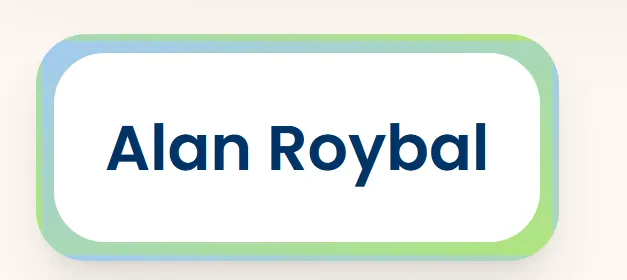

Now let’s try making some **individual Cards**. Cards are small, reusable components that display content such as images, titles, and descriptions in a compact, visually appealing way. By the end of this section, you’ll have a fully styled card that can be used repeatedly to display different content.

### **Why Cards Are Important**

Cards are effective because they:

- **Organize content**: Each card is a self-contained unit, ideal for showcasing specific items or information.
- **Improve readability**: Cards break down information into manageable pieces, making it easier for users to browse.
- **Allow reusability**: A single card component can display various items, each with different data.

# Overview

- Reinforce the concepts we learned in previous sections through repetition and practice.
- Practicing the **important** skill of replicating a design via code.

## Final Product

---

## **Challenge 1:  How can you create a card component and call it on the homepage?**

> **Try to do the initial setup for a component called a “card” and then click to see the answer.**
> 

**Setting Up the Card Component**

1. This step is the exact same process as it was for the other two components. Don’t forget to render the component in `\app.jsx`
[Answer](https://pastebin.com/GZmid5q6)

---

## **Challenge 2: How you can create this card box with text inside?**

> **Add HTML and style the card component so it looks like the *card below*. You should have two boxes stacked on top of each other. The first box should have a blue/green gradient and the box on top of it should be white. They should both have rounded corners. When you hover on the white box it should grow in size to cover the gradient box. In the center you should have some text. Once you have tried it on your own, scroll down to see a possible solution**

1. We start with a simple outer `
` with the `p-4` style to give the card some space.
2. We also want to create a new nested `
` with the same style as the previous border, with the only difference being in the sizing.
3. Again, we create another nested `
` which will have the white background, grow in size upon hover, and also contain all of our information such as the name of the attendee.

Here is the [solution](https://pastebin.com/tY128zBt) in code form.

### Main Takeaway

Creating styles for our components can get quite complicated. But we facilitate the process by taking it piece by piece and understanding what each attribute changes.

---

## **Challenge 3: How would you add an image inside the box?**

> **Add an image inside the card component so it look like the image below. The image should be centered and above the text. The image should also have rounded corners. Choose any image you want, just use CSS to make it square.**

**Solution**

1. Within the ‘inner box’ `
` , let’s add an `` element. Some key attributes you don’t want to forget about are `rounded-xl`, `object-cover`, and `shadow-md`. As for the sizing, there are many ways to go about it. 

Here’s how our [code](https://pastebin.com/fDTsReuZ) looks.

### Main Takeaway

Adding an image inside the card provides a **visual focal point**. The `object-cover` utility keeps the image’s aspect ratio while filling its container, a useful technique for any image where you want to avoid distortion. This approach to images can be used for product displays, blog thumbnails, or profile avatars in cards across your site.

---

## **Challenge 4: Now, add additional text content to our Card**

> **Add/change text so that you have a title for each card and a subtitle *as seen below*. The title should be larger than the subtitle and be a different color. There should be space between the texts and image. The styling does not have to be exactly the same. Make the design your own!**

  
**Solution**

1. Add a new `
` that will contain **all** of our text elements. Let’s add the `space-y-3` attribute so that our text elements have an even vertical spacing.
2. Within this container, we have 3 separate text elements. 
Note that: The HTML tag that you use for text does **not** matter in the context of how it looks on the screen. However for accessibility purposes such as screen readers and general coding convention, try to use tags that represent the information you are displaying.

You can find our solution [here](https://pastebin.com/vSkutwkq).

### Main Takeaway

This code shows how we can display all of our text information within a single container. This helps us keep everything formatted and consistent, at least in terms of spacing. Furthermore, through varying text sizes, we were able to create a hierarchy in the content.

---

## Summary

Cards are meant to be reusable. Now that you have a basic card structure, you can create multiple instances of the `Card` component and customize each one by passing in different data, such as unique titles, images, and descriptions.

### How to Apply This Knowledge

To make this component even more dynamic, you can pass **props** (data passed into components) to customize each card without modifying the code structure. This approach makes your card versatile for listing multiple items, products, or posts in a single section.

---

## Congratulations!😼

On the next page, we will be modifying our card component to dynamically create cards given a json file of information using **props**.