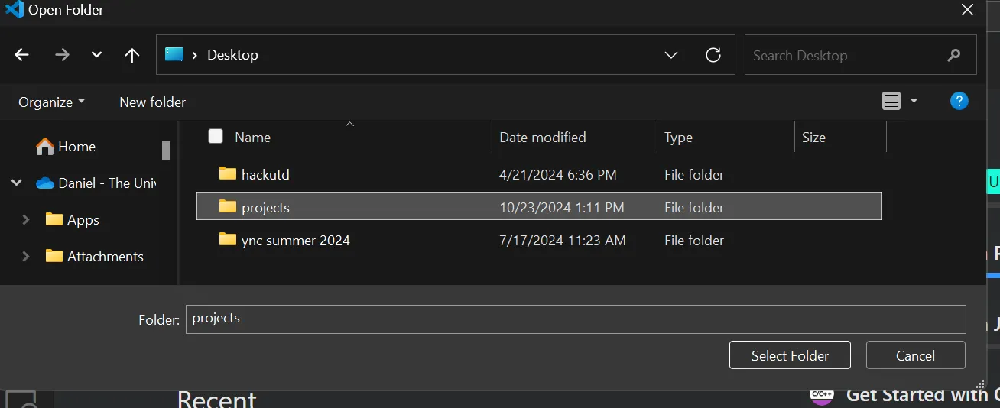
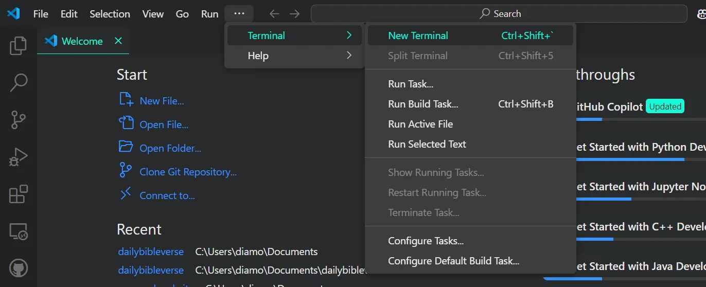
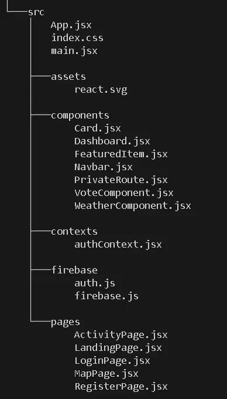
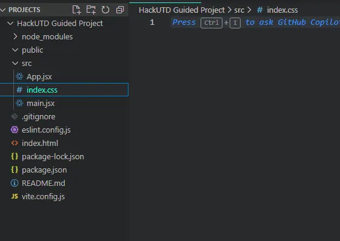
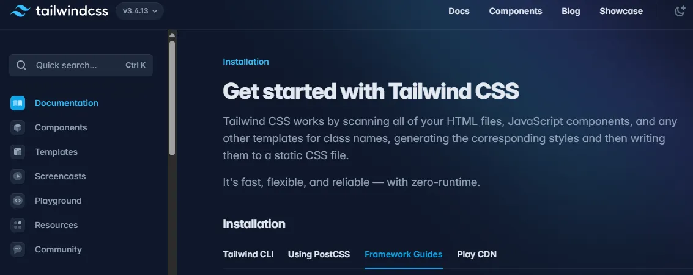
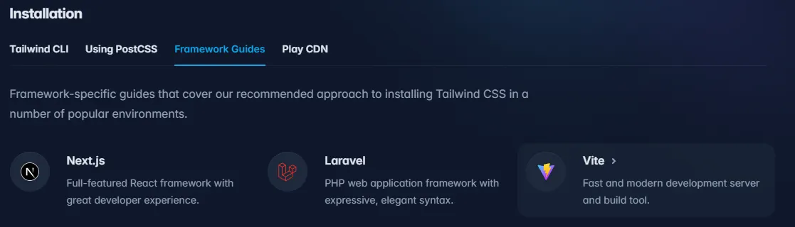
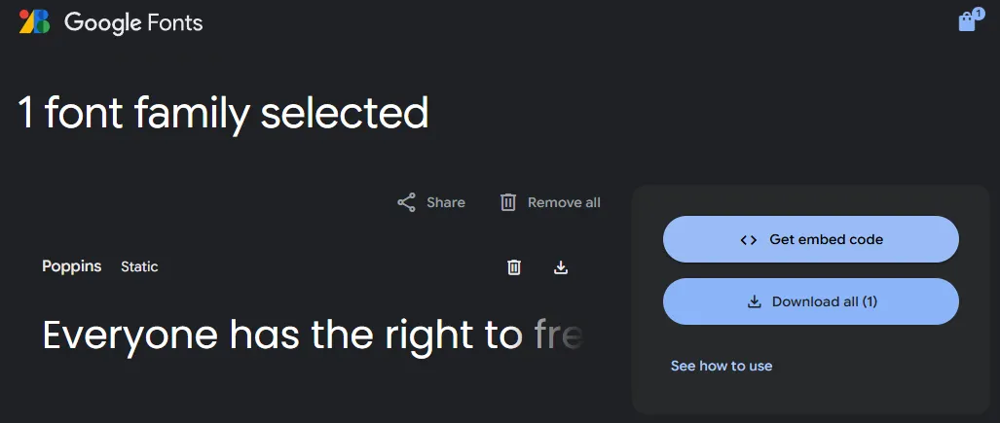
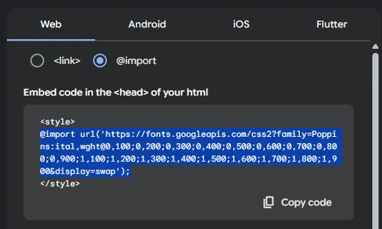
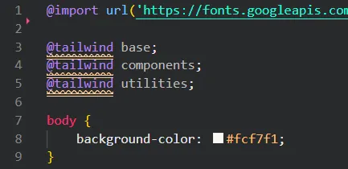

At this point, you should have installed everything necessary to start the development of this project! In this section, we won’t be **creating** any new content. We will simply set up our Integrated Development Environment (VS Code in this case) so that it’s ready for us to start creating our full-stack application.

# Overview:

- Initialize our React Project using Vite (a JavaScript build tool)
- Install Tailwind CSS into our project
- Adding a custom font
- Adding custom colors

:::tip
Are you familiar with **Github**? Do you know how to create branches so that your team members can work in parallel? If not, we have some resources to get you started on understanding Github and the work flow. [Github Resources](https://guide.hackutd.co/Workshops/Github/workshop) 

It’s imperative that your team understands how to handle merge conflicts and create pull requests. Without this knowledge, working on a project seamlessly together will prove challenging.

Once the project is setup and everyone has access to it, that is when you guys should begin working in separate branches. Don’t make the mistake of everyone creating their own independent project and trying to copy/paste code into each other’s IDEs to combine it.
:::
---
## File Directory Setup

> Before we get into creating our first project, we want to make sure that we know *where* we’re building it.

1. Open Visual Studio Code
2. Click on “File” in the top left corner and click on “Open Folder”
3. Navigate to where you want to create your folder. Right-click in the file explorer to create a new folder to hold your project directory. *You can skip this step if you already have a folder dedicated to your projects.
    1. Do note that this folder will be the **parent folder** and will not be the folder of the **actual project files.** This means that this folder should be titled something generic such as “Projects” or even simply choose your Desktop.
    2. When we run the commands in the future steps, we will be creating a new folder **dedicated to the project itself** within the folder we are currently in.
    
    3. At this point, your VS Code should be in the working directory of the folder you have recently or previously created.
---

## Vite

1. Go to your web browser and search up [Vite](https://vite.dev/guide/) (or click the embedded link)
    1. This will link you to the documentation page of Vite. 
    2. *An **essential** skill of a programmer is to become comfortable with reading these pages. *
2. Scroll down to “Scaffolding Your First Vite Project”
    1. You can follow any of the installation methods listed, but we recommend running this single line in your VS Code terminal.
3. In your terminal, run the following command: `npm create vite@latest`
    1. To open your terminal, you can find the button in the top bar of VS Code as shown below. You could also use the shortcut ``` Ctrl + Shift + ` ```  where the last symbol is “back-tick” which can be found below the Escape key.
    
4. Follow the instructions for the installation
    1. You will be prompted to install a package, name your project (whatever you want), and choose what framework you will be using. Below is an example of what this process would look like.
        
        ```bash
        PS C:\Users\diamo> npm create vite@latest
        Need to install the following packages:
        create-vite@5.5.4
        Ok to proceed? (y) y
        ? Project name: » HackUTD Guided Project
        ? Package name: » hackutd-guided-project (Press enter)
        ? Select a framework: » - Use arrow-keys. Return to submit.
            Vanilla
            Vue
        >   React
            Preact
            Lit
            Svelte
            Solid
            Qwik
            Angular
            Others
        ? Select a variant: » - Use arrow-keys. Return to submit.
            TypeScript
            TypeScript + SWC
        >   JavaScript
            JavaScript + SWC
            Remix ↗
        ```
        
5. At this point, your terminal should look similar to the output below. Continue following the steps and run the commands.
    ```bash
    PS C:\Users\diamo> npm create vite@latest
    Need to install the following packages:
    create-vite@5.5.4
    Ok to proceed? (y) y
    √ Project name: ... HackUTD Guided Project
    √ Package name: ... hackutd-guided-project
    √ Select a framework: » React
    √ Select a variant: » JavaScript

    Scaffolding project in C:\Users\diamo\HackUTD Guided Project...

    Done. Now run:

      cd "HackUTD Guided Project"
      npm install
      npm run dev

    PS C:\Users\diamo> cd '.\HackUTD Guided Project\'
    PS C:\Users\diamo\HackUTD Guided Project> npm install

    added 257 packages, and audited 258 packages in 19s

    100 packages are looking for funding
      run `npm fund` for details

    found 0 vulnerabilities
    PS C:\Users\diamo\HackUTD Guided Project> npm run dev

    > hackutd-guided-project@0.0.0 dev
    > vite

      VITE v5.4.10  ready in 438 ms

      ➜  Local:   http://localhost:5173/
      ➜  Network: use --host to expose
      ➜  press h + enter to show help
      ```
6. Now you should be able to click on the Local server link and see the React + Vite test page. Take some time to mess around with the site. Take note of a few of the features such as the storage and updating of information, hover effects, etc. By the end of this project, you will be able to implement these features on your own.
    1. To shut off your development server, click on the terminal and hit `ctrl+c` 
    To start up the server again, execute `run dev` in the terminal.
    You can find more useful shortcuts in our [All Resources](https://www.notion.so/All-Resources-cbd6054a4e4e4e619f4279490ef1d015?pvs=21) in the **Essential Shortcuts page.**
7. Your file directory should like the screenshot below. We will now briefly explain the directory, but you can learn more about it [here](https://github.com/alan2207/bulletproof-react/blob/master/docs/project-structure.md). Though this may be confusing right now, eventually it’ll all come together.
  
    1. `\root\src\`
        1. This folder is where **all** our code will go. This includes our components, hooks, utilities, and more.
    2. `\root\public\`
        1. This folder is where we can store any downloaded images or other assets such as icons.
    3. `index.html`
        1. This file is the foundational HTML structure that is used to display all of the content in our project.
    4. `App.css` & `index.css`
        1. Any .css files are used for styling purposes.
    5. `main.jsx` vs `App.jsx`
        1. These are both .jsx files but have unique and vitally important purposes. 
        `main.jsx` is the **entry point** for our application. You can think of it as the root of our project.
        `App.jsx` on the other hand is where we put all of our React code such as pages and components. 
        *Note: `App.jsx` is a component and is **called** in the `main.jsx` file.’

    The final file structure should look like this. Though there are many components that we haven’t created yet, this serves as a reference for the future.
      

8. Before we move on to the next step, let’s clean up our file directory a little bit.
We’re going to be **deleting** the following things:

      1. `App.css` found in the `src/` folder
      2. `vite.svg` found in the `public/` folder
      3. The **content** of `index.css` found in the `src/` folder
      4. The folder `assets/` found in the `src/` folder
          1. Do note that we attempt to `import` this file within our `App.jsx` file towards the top. Make sure you remove that file to avoid this error.
        
9. Now your `index.css` file should be empty and your directory should look like the screenshot below. Let’s move on to the next section!

  

---

## Tailwind CSS

> As some of you may already know, CSS is what enables us to stylize our web page and make it look nice. Tailwind is a tool that allows us to write CSS effectively and faster. We will now be adding Tailwind into our project using Node Package Manager (NPM). Documentation regarding npm can be found [here](https://docs.npmjs.com/about-npm). For our purposes, you just need to know that the keyword npm is used in the terminal to install packages from the internet directly into our project.

1. Go to your web browser and search up [Tailwind](https://tailwindcss.com/docs/installation) (or click the embedded link)
2. Click on “Docs” which can be found on the navbar. Proceed to the “Framework Guides” section found in the screenshot below.

3. Within this section, find the Vite installation guide shown in the screenshot below.

4. We can skip Step.1 because we already initialized our project in the previous section. Instead, start at step 2 and run the following commands in your terminal:
  ```bash
      npm install -D tailwindcss postcss autoprefixer
      npx tailwindcss init -p
  ```
5. After running these two commands, we should now see the `tailwind.config.js` file in our directory.
6. As seen in the documentation for step 3, we need to add some lines of code into the file.
  ```javascript 
// inside tailwind.config.js
export default {
	content: ['./index.html', './src/**/*.{js,ts,jsx,tsx}'],
...
}
  ```
7. Make your way into the `index.css` file found in the `./src` folder that should already be empty. Now we can just copy and paste these three lines into it.
    1. If you see squiggly lines, you can ignore those.
      ```css
      /*inside index.css*/
      @tailwind base;
      @tailwind components;
      @tailwind utilities;
      ```

---

## Adding a Custom Font

Now that our Tailwind CSS is setup, let’s add a custom font to our project.

1. Go to your web browser and search up [poppins google font](https://fonts.google.com/specimen/Poppins?query=poppins) (or click on the embed)
2. Click on “Get font” found in the top right corner
3. Click on `<> Get embed code`


4. Switch the type to @import and copy the code without the `<style>` tags.

5. Go back to your `index.css` file and paste it in at the very top. 
6. Also, add this code at the bottom of the file. `body` applies the styles to the body of the project. The `background-color` will make the entire background to this yellowish-white color. Your `index.css` file should now look like this:

7. We want to now add some variations of fonts such as bold and semibold. We can simply go back to the Google Fonts page and copy and paste the entire CSS class list.
Now your index.css file should look like this:
```css
  /* index.css */
  @import url('https://fonts.googleapis.com/css2?family=Poppins:ital,wght@0,100;0,200;0,300;0,400;0,500;0,600;0,700;0,800;0,900;1,100;1,200;1,300;1,400;1,500;1,600;1,700;1,800;1,900&display=swap');


  @tailwind base;
  @tailwind components;
  @tailwind utilities;

  body {
      background-color: #fcf7f1;
  }

  .poppins-thin {
      font-family: 'Poppins', sans-serif;
      font-weight: 100;
      font-style: normal;
  }

  .poppins-extralight {
      font-family: 'Poppins', sans-serif;
      font-weight: 200;
      font-style: normal;
  }

  .poppins-light {
      font-family: 'Poppins', sans-serif;
      font-weight: 300;
      font-style: normal;
  }

  .poppins-regular {
      font-family: 'Poppins', sans-serif;
      font-weight: 400;
      font-style: normal;
  }

  .poppins-medium {
      font-family: 'Poppins', sans-serif;
      font-weight: 500;
      font-style: normal;
  }

  .poppins-semibold {
      font-family: 'Poppins', sans-serif;
      font-weight: 600;
      font-style: normal;
  }

  .poppins-bold {
      font-family: 'Poppins', sans-serif;
      font-weight: 700;
      font-style: normal;
  }

  .poppins-extrabold {
      font-family: 'Poppins', sans-serif;
      font-weight: 800;
      font-style: normal;
  }

  .poppins-black {
      font-family: 'Poppins', sans-serif;
      font-weight: 900;
      font-style: normal;
  }

  .poppins-thin-italic {
      font-family: 'Poppins', sans-serif;
      font-weight: 100;
      font-style: italic;
  }

  .poppins-extralight-italic {
      font-family: 'Poppins', sans-serif;
      font-weight: 200;
      font-style: italic;
  }

  .poppins-light-italic {
      font-family: 'Poppins', sans-serif;
      font-weight: 300;
      font-style: italic;
  }

  .poppins-regular-italic {
      font-family: 'Poppins', sans-serif;
      font-weight: 400;
      font-style: italic;
  }

  .poppins-medium-italic {
      font-family: 'Poppins', sans-serif;
      font-weight: 500;
      font-style: italic;
  }

  .poppins-semibold-italic {
      font-family: 'Poppins', sans-serif;
      font-weight: 600;
      font-style: italic;
  }

  .poppins-bold-italic {
      font-family: 'Poppins', sans-serif;
      font-weight: 700;
      font-style: italic;
  }

  .poppins-extrabold-italic {
      font-family: 'Poppins', sans-serif;
      font-weight: 800;
      font-style: italic;
  }

  .poppins-black-italic {
      font-family: 'Poppins', sans-serif;
      font-weight: 900;
      font-style: italic;
  }
```
### Adding Another Custom Font

Now we have successfully imported Poppins into our project. 
Try importing another font called **Inter** on your own! Note that for the styling, we will provide the code for the *regular* and *semibold* font styles. 

At this point, your code should look something like this: [answer](https://pastebin.com/kCPMHekR)

---

## Adding custom colors

You might be wondering, *” What’s the point?”*

It is ideal to create a color scheme during the initial design of a project. This helps to create a consistent theme across all elements and also simplifies the process of using **custom colors** that aren’t natively provided in Tailwind. Take a look at this [documentation](https://tailwindcss.com/docs/customizing-colors) if you have more questions.

We will be adding 5 custom colors, and you can find the code for the entire `tailwind.config.js` file below:
```js
/** @type {import('tailwindcss').Config} */
export default {
  content: ['./index.html', './src/**/*.{js,ts,jsx,tsx}'],
  theme: {
      extend: {
          colors: {
            pastelblue: '#A1CAF1',
            pastelgreen: '#B0E57C',
            pastelpink: '#FDC1C5',
            darkgreen: '#355E3B', 
            darkblue: '#003366',
          },
      },
  },
  plugins: [],
};
```

---

## Congratulations!

You’ve made it to the end of this section! Another friendly reminder to take a break. When you’re ready, go to the next page where we’ll guide you in the creation of your first React component!

We will assume that you guys have a baseline understanding of HTML, CSS, and Javascript. However, if you require additional resources or help, you can find related documentation here: [All Resources](https://www.notion.so/All-Resources-cbd6054a4e4e4e619f4279490ef1d015?pvs=21)
