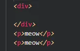
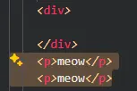
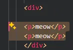
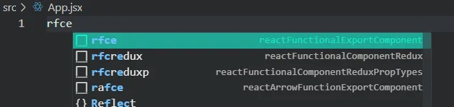
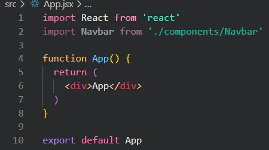
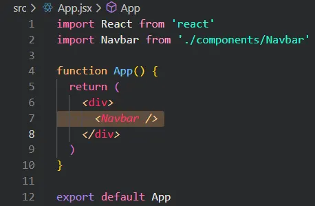
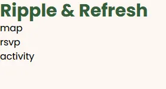
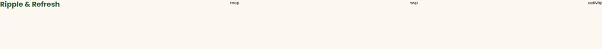

Before diving in, let’s understand what **React** is. React is a **JavaScript library** (a collection of code that helps build things) that makes it easier to design parts of a website. With React, you build small, reusable pieces of a website, like buttons, menus, or forms, that can be easily put together to make a full webpage.

# Overview:

- Creating our first component: the Navbar
- Importing it into our page
- Styling our component
- Creating a divider

### What’s a Component?

> Think of a **component** as a building block. Just as LEGO bricks combine to create a complex structure, components join together to form a website. A **Navbar**, for example, is a component that houses links to various pages on the site.
> 
1. Inside your `\root` folder there’s an `\src` folder. Inside the `src` folder, we want to create a folder called `components`. This will hold the individual parts (or components) you create.    <!-- Dawg we need to insert vs code file tree but where the image>
2. In the `components` folder, create a new file called `Navbar.jsx`. This file will contain all of the information regarding our navbar component.

### Some Useful Shortcuts:

Reformatting your code using Prettier: **alt+shift+f**

Moving a block of code up or down without copy and pasting: alt + ↑ / alt + **↓**

This is especially useful when you want to create an outer HTML component that will contain your block of code.

1. *Highlight the section* 
2. *alt + direction*

       

---

## **Challenge 1: How do we create a React component?**

> A **react component** is a singular piece of UI. It contains JavaScript functions that return an HTML element.
```js
  // Navbar.jsx
  import React from "react";
  function Navbar() {
    return <div>Ripple & Refresh</div>;
  }
  export default Navbar;
```

### Main Takeaway

- **`function Navbar() {...}`**: Creates a **function** named `Navbar`. Also being the component.
- **`return <div>Ripple & Refresh</div>;`:** Outputs a singular HTML div element. Within it is contained our content, “Ripple & Refresh”. Keep in mind: React components can only return 1 HTML tag so everything for the component will be enclosed in this `<div>` tag.
- **`export default Navbar;`**: Allows us to use this component in other files. We do this via the keyword `import` and we will see how we can do this in our next step.

### Tips:

- If you installed the “ES7 React Snippets” extension that we mentioned earlier, you can type ‘rfce’ + enter in an empty .jsx file, it will fill that boilerplate snippet shown above.

---

## **Challenge 2: How can we add the Navbar component to our main page?**

> As we mentioned before, components are **exported** to enable us to **import** them within other files. This can be done in a single line of code, typically found at the top of the file.
> 

1. Navigate to the `app.jsx` file found in the `\src` folder.
We can go ahead and delete all of the code inside of this file because it’s boiler plate that came with the installation. 
2. In case you didn’t try it earlier, now is another good opportunity to type in ‘rfce’ which will paste in a JavaScript export function snippet.

3. And now your component should look similar to this
```js
// App.js
import React from 'react'

function App() {
  return (
    <div>App</div>
  )
}

export default App
```

4. Let’s finally get into the meat and potatoes of this challenge. You might have been able to guess it based off of the information in the previous challenge, but we want to use the import statement. 

  To import our Navbar, we only need one line of code:import Navbar from `./components/Navbar`. Conventionally, the name of the component will be the same name of the file name we import from, another example being import Hero from `./components/Hero`. Also note that the way we find the imported component information is through the relative file path in our directory. For more information regarding importing and exporting components, visit this link.

  At this point, your App.jsx should look similar to the screenshot below.
  

5. But just because we imported it doesn’t mean that we’re using it just yet.  
In order to render  the component we just made, we can call it similarly to the way we would create an HTML tag: `<Navbar />`.  So React components become their own self enclosed HTML tag!

  

### Main Takeaway

The `import` allows us to use individual components that we’ve built separately and bring them together into a single file. This allows for modularization and re-usability.

**Extra Problem**: Let’s say I wanted to display 5 Navbars, how should I go about accomplishing this?

[Answer](https://pastebin.com/dJwiunLz) 

*note*: there is no need to copy and paste this into your doc, it’s just a brain teaser.

---

## **Challenge 3: How can we style our component?**

> Let’s go back to our `Navbar` component. In this challenge, we’re going to find out how we can update the styling of our text “Ripple & Effect”
> 

If you need a refresher on CSS and Tailwind, here is some documentation for each:  
[CSS documentation](https://developer.mozilla.org/en-US/docs/Learn/CSS/First_steps/What_is_CSS)  
[Tailwind documentation](https://v2.tailwindcss.com/docs)  
You can either use the search function within the tailwind documentation to find relevant documents. or simply search on google e.g. “tailwind how to center text”

**Basic Tailwind Tutorial:**  
Within the HTML tag, create an attribute called `className=""` . And within these quotes you can list whatever Tailwind style classes that you want e.g. `font-bold` and `bg-black`

We highly recommend you fiddle around with Tailwind styling to see how these attributes affect our display. By practicing and building more React components, applying Tailwind will become much easier. You can find some of the most common Tailwind attributes here: [Common Tailwind Attributes and Examples](https://www.notion.so/Common-Tailwind-Attributes-and-Examples-1380d994cbb98037950bc03069272fbd?pvs=21)  

2. **Problem**: Try making the **text bigger**, **bold**, and give it the **darkgreen custom color** that we created earlier. Try it on your own before revealing the answer!!  
    [Answer](https://pastebin.com/3EA0e1E7)

### Main Takeaway

With Tailwind CSS, we can easily apply **in-line** styling to any HTML element that we want. The styles can also be applied in any order. As programmers, our only concern is knowing exactly *what* styling we want, and *how* to apply it. **Google** and **documentation** is our best friend for this. 

---

## **Challenge 4: How can we create a list of items that go left to right?**

> By default, HTML elements are stacked in a vertical top-down fashion. The way we enable these elements to orient themselves horizontally is through [**flexbox](https://css-tricks.com/snippets/css/a-guide-to-flexbox/).**

1. First, let’s create the list of elements that will make up our Navbar. For now let’s say our elements are ‘RSVP’, “Activity”, and “Map”
2. **Problem:** How can we create 3 separate text elements on our screen as seen in the image below?
  
[Answer](https://pastebin.com/EZRfCC6C)

3. Now that we have Nav items, let’s figure out how we can make them side by side. The key attribute that we need to add is *flex,* but where should we add it?
This is actually a **trick question** because we need to add it to **both** of our `<div>` tags and here’s why.
After adding `className='flex justify-between'` to **only** the parent div, my display shows this:

`justify-between` evenly spaces all of the children of the `<div>`, which would include the title, and our three pages. But this makes the home page look sparse and unreadable. Instead, we want the Title on the left, and the rest of our page links grouped together on the right.
How can we group up the page links?  

  By wrapping them in another `<div>`!

  Don’t forget to add `className='flex gap-8'` to space them out evenly on the X axis.
  And before we move on to the next section, let’s add some more css to the *outer div* such as: `items-center` (centers the items on the y axis), `px-20` (padding on the x-axis), and `py-4` (padding on the y-axis). Notice how we have `flex` ***and*** `flex-row`. Although flex-row is the default behavior of `flex`, but it’s good practice to specify.

  Final code:
  ```js
  import React from "react";

  function Navbar() {
    return (
      <div className="flex flex-row justify-between items-center px-20 py-4">
        <div className="text-darkgreen text-3xl poppins-bold">
          Ripple & Refresh
        </div>
        <div className="flex flex-row gap-8">
          <p>map</p>
          <p>rsvp</p>
          <p>activity</p>
        </div>
      </div>
    );
  }

  export default Navbar;
  ```

### Main Takeaway

Each `<p>` (paragraph) tag represents a different word in our Navbar. Placing them inside a `<div>` will let you apply the same styles to each `<p>` tag. Letting you do **group styling** :D

## **Challenge 5: How should we style these words?**

> Our page links feel a little bland. Below is a list of attributes that you should try playing with. Adjust the Navbar to your liking!
> 
> - font weight
> - text size
> - text color
> - hover effect

To see how we styled it, click [here](https://pastebin.com/XV2J5i24).
If you like your design better, keep it! Make this project your own. We want to see creativity and uniqueness throughout the submissions.

1. Before we move on, let’s make some final adjustments to our code to improve the readability.
    
    When we style an attribute to a parent container, such as the outer div, that style will apply to all children, grandchildren, etc. Do note that this only applies to **inheritable** css attributes.
    Now knowing this, we can move some of the styles to the `<div>` that *contains* the `<p>` tags like so:

    ```js
    {/* PAGES */}
  <div className="flex flex-row gap-8 poppins-semibold text-2xl text-darkblue">
    <p className="hover:text-pastelgreen transition duration-300">map</p>
    <p className="hover:text-pastelgreen transition duration-300">rsvp</p>
    <p className="hover:text-pastelgreen transition duration-300">activity</p>
  </div>;
  ```
  Note that the `hover` effect and the other transitional styling are kept separate or else the entire list of pages would light up green upon hovering only one of them. Also, we added the `hover` effect to our title as well.  

### Main Takeaway

To make our code readable, reduce redundancy where you can. We know that we want to apply `poppins-semibold text-2xl text-darkblue`  to all of our child `<p>` tags, so we can apply them all to the parent instead.

---

## **Challenge 6: How can we separate the Navbar from the rest of the page?**

> A common characteristic of the Navbar in modern websites is its separation from the rest of the page. This can be accomplished in many ways, but the most common method you’ll see is either contrast in color, a horizontal line, or dynamic sizing.
>
In this project, we will be using **both** contrast in color and a horizontal line.

1. Let’s start off with the contrast in color. 
**Problem:** Which ***attribute*** of which **element** should we change to adjust its **overall color?**  
  [Answer](https://pastebin.com/kkBJ4BQZ)
    
2. Now that we have our adjusted Navbar, let’s add a horizontal line to the bottom of it.
**Problem:** How can we add a *single* horizontal line at the bottom? *Hint:* *Maybe there’s an HTML tag that exists solely for this purpose.*  
[Answer](https://pastebin.com/NPGeETKM)

### Main Takeaway

Having a separation between the Navbar and the rest of the page is good practice and can be done in several ways. In this section, we implemented two of the methods mentioned.

---

## **Congratulations!🎉**

This will be the heaviest chapter in terms of the front-end. Moving forward, there will be much less teaching but instead more Problem→Answer style active recall. 

**If you are ever stuck and need assistance, don’t hesitate to ask in the** 
**#guided-track channel found in our discord server!**