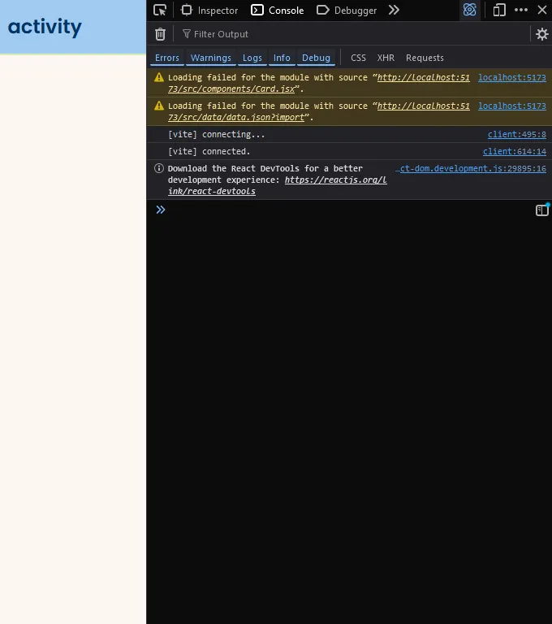
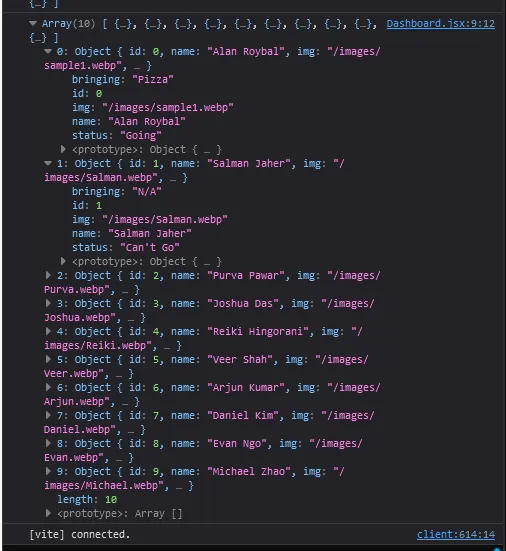

In this guide, we’ll make **reusable, customizable Card components** using React and **props**. Props allow you to pass specific data to each component so that each card can display unique information without rewriting the component itself.

### **Why Reusable Components Are Important**

Reusable components save time and keep your code organized. Think of a list of products in a store or blog posts on a news site. You don’t want to write a new component for each item—props allow you to use one component for all items, customizing each one with its own data.

### What You’ll Learn

- [Props](https://www.w3schools.com/react/react_props.asp)
- [Map Function](https://react.dev/learn/rendering-lists)

---

## **Challenge 1: What are props?**

> Now that we have a basic card structure, let’s make it customizable by introducing **props**. In React, **props** (short for “properties”) are a way to pass data into a component to make it more flexible. You can read more about props [here](https://www.w3schools.com/react/react_props.asp).
> 
1. **Add Props to the Function Header**: Update the function header by adding `props` as a parameter. This tells React that the component will receive some data from outside.
  ```js
  // Card.jsx
  import React from "react";  
  function Card(props) {
    return (
      ...
    );
  }
  export default Card;
  ```

---

## **Challenge 2: How do we use** props**?**

Now that `props` is set up, let’s replace the hard coded content with data from `props`. This will make it so each card can display unique information passed in from outside.

1. Replace the static content with `props` variables. Wherever there was hard coded text or an image URL, replace it with `props.variableName`, like `{props.name}`, `{props.img}`, etc.

### Code Change Highlight
```js
// Card.jsx
<div className="h-full w-full rounded-2xl bg-white p-4 transition duration-300 hover:scale-105">
  
  <div className="space-y-3">
    <h1 className="poppins-semibold text-xl text-darkblue">{props.name}</h1>
    <p className="inter-regular flex py-1 text-sm text-gray-500">
      Bringing: {props.bringing}
    </p>
    <p className="inter-semibold text-sm text-emerald-500">{props.status}</p>
  </div>
</div>;
```

### Explanation

Using `{props.img}`, `{props.name}`, `{props.bringing}`, and `{props.status}` lets us customize the card with different information each time we use it. This approach makes the component reusable with unique data each time, which is particularly useful for displaying lists of similar items like products, profiles, or posts. 
In this next step, we’ll create a **dashboard** component that will render the `<Card />` component.

---

## **Challenge 3: What is the dashboard?**

We’ll use a new component called `Dashboard.jsx` to send information to the `<Card />`  component. 
What’s the purpose of this dashboard? It’s going to act as a container for our cards and display them in a grid, and also handle the information processing.

1. Create a new `Dashboard.jsx` component and render it in our `app.jsx` file. 
We can take out the `<Card />` from `app.jsx` because we are going to be rendering card in the dashboard now.
2. Copy this [boiler plate code](https://pastebin.com/6YbU5ebJ) for the `Dashboard.jsx`  component. We will be focusing on the **functionality** in this section.

---

## Challenge 4: How do we pass in data to our Card with our Dashboard?

> How do we pass in information into our card component? How does it know what to use?

1. Start by rendering a `<Card />` component within our `Dashboard.jsx` file in the ‘Event List Grid `<div>`'
2. What four *properties* does our card component expect to utilize? It’s these four:
    1. img
    2. name
    3. bringing
    4. status

    ```js
    {/* Event List Grid */}
	<div className="relative z-10 grid sm:grid-cols-1 md:grid-cols-2 lg:grid-cols-3 gap-6">
	  {/* Map through items and render a Card component for each in the section below */}
	  <Card />
	</div>;
    ```
3. Let’s pass in the correct information for the four attributes by declaring those variable names with its respective value. We do this by creating the attribute name and assigning the value within the Component parameters.
  ```js
  {/* Event List Grid */}
    <div className="relative z-10 grid sm:grid-cols-1 md:grid-cols-2 lg:grid-cols-3 gap-6">
      {/* Map through items and render a Card component for each in the section below */}
      <Card 
      img='/images/sample1.webp'
      name='Alan Roybal'
      bringing='Fruit'
      status='Going'
      />
    </div>
  ```
4. At this point, you should be able to see the same Card display that we saw earlier when we hardcoded the information within the `<Card />` component. Note that we are still hardcoding it right now, but just passing in the information instead.

### Main Takeaway

We changed our Card component to expect an object called `props` within its function parameters. We then **destructured** the props object with the dot ‘.’ operator into separate attributes such as `props.img` and `props.name`. We then rendered a new `<Card />` component within our `Dashboard.jsx` file that specified the **value** of these attributes. Essentially we passed in an image, name, bringing, and status value for our Card component to utilize.

---

## **Challenge 5: How can we use .json files within our Dashboard component?**

> **In this challenge, we are going to understand how the data.json file works.**

1. Let’s add our `data.json` file into our directory. 
In `\root\src\` create a new folder called `\data` . It should be at the same level as the `\components` folder.
You can either copy and paste this [code](https://pastebin.com/rfssiWMh) and paste it into a file called `data.json` within the `\data` folder
 or download this [file](https://drive.google.com/file/d/1sCzywZM9P4dvXi-t7_onvQdsIQBWhD9y/view?usp=drive_link) and add it to your `\data` folder.
2. Let’s understand the structure of the `data.json` file:
This JSON file contains an array of objects. Each object represents an individual entry with several properties. In our file, we have the following fields/keys:
  1. id - an int that is the unique identifier for each object
  2. name - a string of the name of the person
  3. img - a relative path to the image based on our `\public\image` folder
  4. bringing - a string he item that a person is bring
  5. status - a string of their event status
3. Each object in the array represents a **card’s data**, so you can imagine that each entry will be used to populate a unique and separate Card component. You can modify this file to your liking to change the idea of your project.

## Challenge 6: How can we leverage the Browser Development Tool?

**How can you display the information contained in our data.json file? How can we access the Browser Development Tool? You can access the tool by right clicking on your browser and pressing inspect element. You can also press ‘ctrl + shift + i’ or f12**

In our previous challenge, we added the `data.json` file into our directory. 
Let’s import our data into our Dashboard so that we can use it.

Just like we would import any React component, we can import our `data.json` in the same fashion with a single line of code: `import data from '../data/data.json'`

How would we display how this data is formatted within our component?
1. **Add a `console.log(data);`** statement within our `function Dashboard()`
    1. The body of our function expects Javascript, whereas our `Return ()` statement expects HTML.
    This should be your [code](https://pastebin.com/5eUWQfdb) at this point.
2. Open your browser’s developer tools (usually F12 or right-click > Inspect) and go to the **Console** tab.
It should look something like this:

3. Refresh the page and you should be able to see the console.log(data) output in the console.

4. But what does this information mean? We can see how each object has a set of its own attributes. We are going to be using this information in our next step.

### Explanation

Using `console.log(props);` in the console lets you see the data being passed to the component. It is an essential skill to understand the developer tools of your browser and `console.log` is just one of the ways to utilize it.

---

## Challenge 8: How can we loop through all of our data?

> Not only do we have to loop through all of our data, we need to create a separate Card component for each index of our data. Is there an effective way to accomplish this? Look through this [documentation](https://react.dev/learn/rendering-lists) and see if you can figure out which method we need to use.
> 

Hopefully after reading through that page you’ve figured out that we need the `map` function! 

1. First let’s ask ourselves, what are we mapping through?
It’s the `data.json` file we imported earlier. We gave it the name `data` so that is how we will refer to it from hence forth.
2. Now to map through this file, our code should have this structure. *Note that this code is incomplete as of now.*

```js
data.map( (object) => <Card />)
```
3. If we leave the code as it currently is, our output should look like [this](https://imgur.com/1XWNUx0). And this is **exactly** what we want right now. For every object in our list, we are rendering an individual Card component. Our next step is to **destructure** our object into its separate attributes and **pass** it into our Card.
    1. What attributes do we need to pass in again? *Hint: Check the Card component*
        1. Answer: `img`, `name`, `bringing`, and `status`!
4. Below is the code for our map function:
  ```js
  {/* Event List Grid */}
  <div className="relative z-10 grid sm:grid-cols-1 md:grid-cols-2 lg:grid-cols-3 gap-6">
    {/* Map through items and render a Card component for each */}
    {data.map((object) => (
      <Card
        key={object.id}
        name={object.name}
        img={object.img}
        status={object.status}
        bringing={object.bringing}
      />
    ))}
  </div>;
  ```
    1. Let’s briefly explain what’s going on within our Card component.
        1. If you look back at our `data.json` file, we have the a set of keys and values for every object such as `"id: 0, "name": "Alan Roybal",`. When we destructure each object, we need to use the **same** key name for each attribute, i.e. `object.id`, `object.name`, etc.
        2. As for the left hand side `key=` , `name=` , etc. these are the **prop** variables that the `<Card />` component expects to have. So these variables must match the props.variable names that we declared in the Card component.
5. Here’s the final code for this [section](https://pastebin.com/202b0XHA).

### Main Takeaway

**Map Through the Data**: Use `map` to iterate over each object in the data array, creating a new `<Card />` component instance for each.

**Destructure the Object**: Break down each data object into its key-value pairs, passing only the needed values like `img`, `name`, `bringing`, and `status` as props to `<Card />`.

---

# **Summary**

By passing data through props, you’ve learned how to:

- **Debug and inspect** props in the console to better understand how data is managed in React.
- **Customize and reuse components** by passing data into them rather than hardcoding content.

---

## Congratulations!⭐

You’re almost done! We have just one more page left for front-end, and it’s arguably the easiest one! Give yourself a big pat on the back for a job well done and take a nice long break because you deserve it!