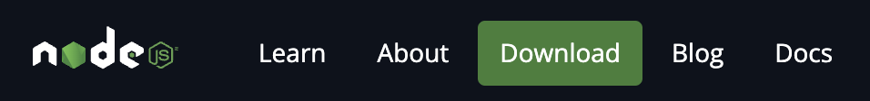
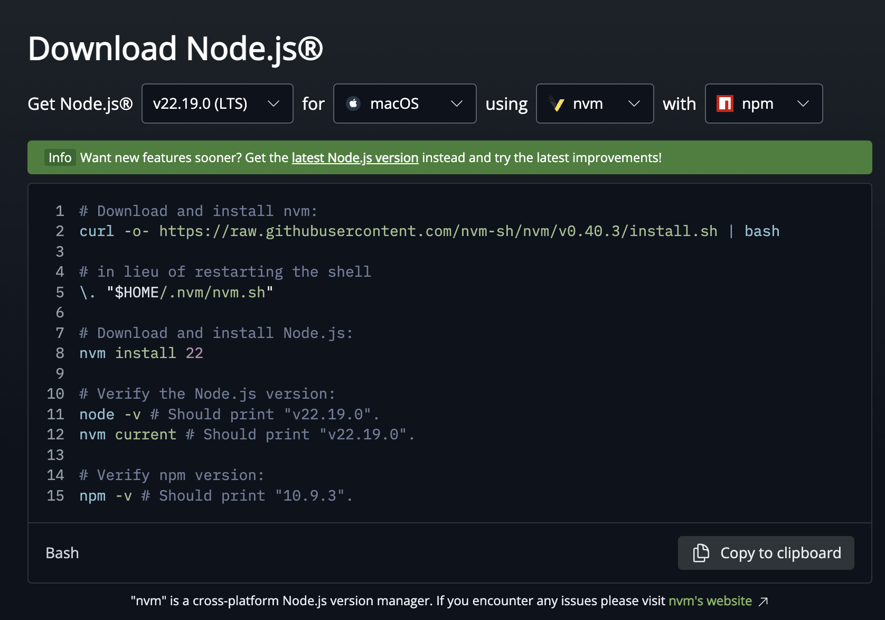
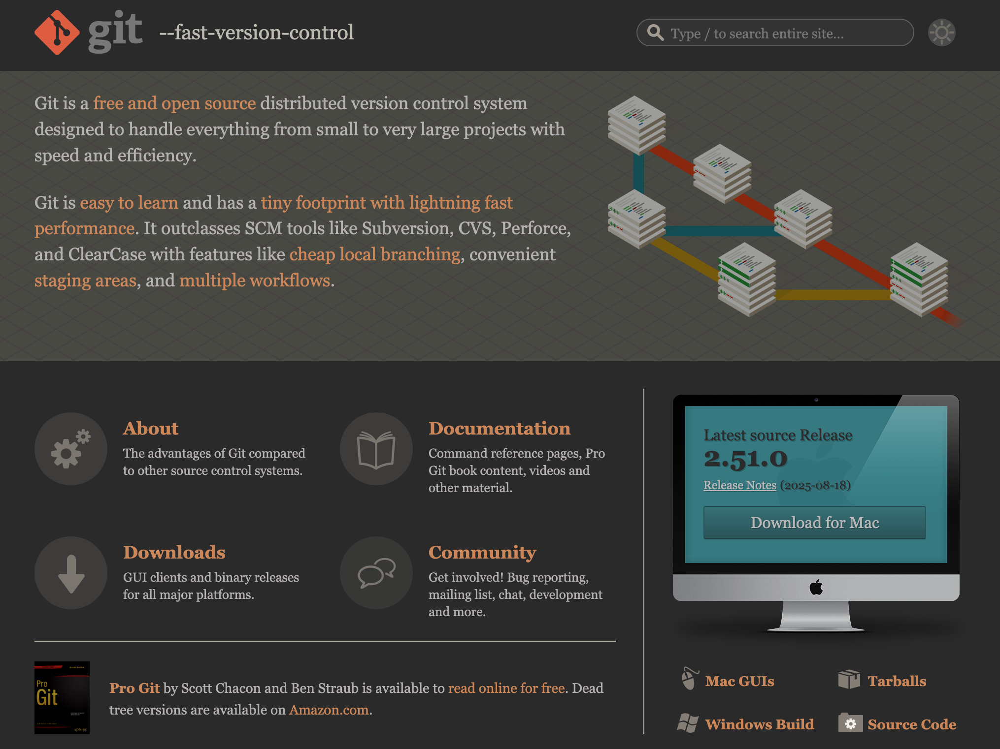
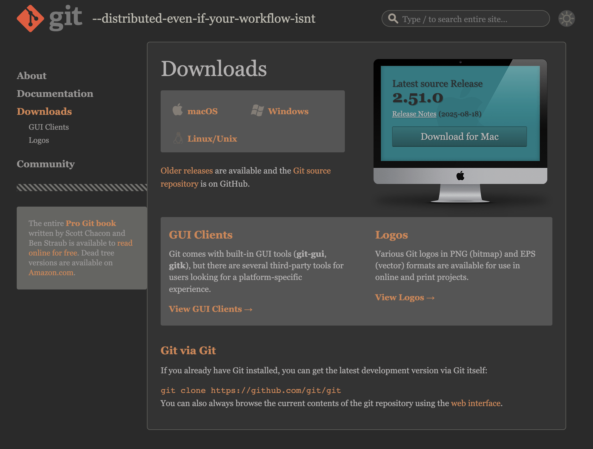
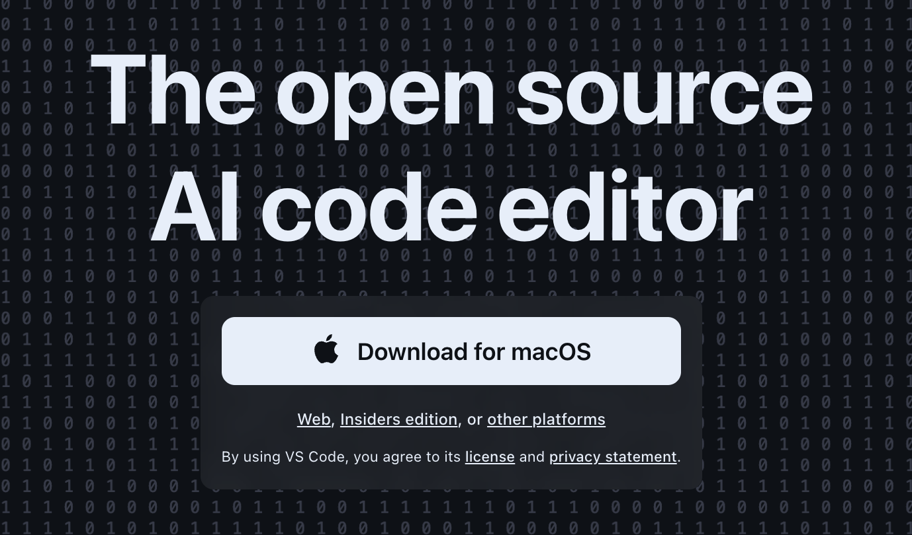
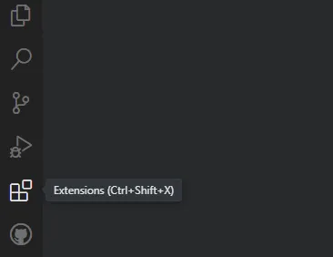
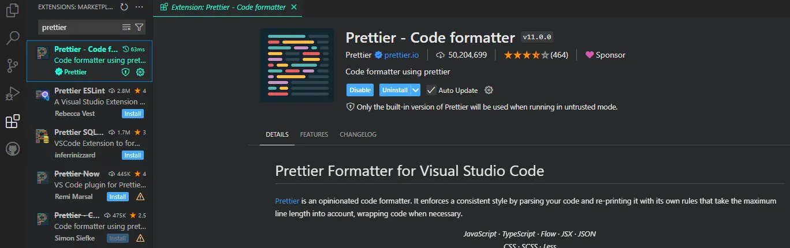
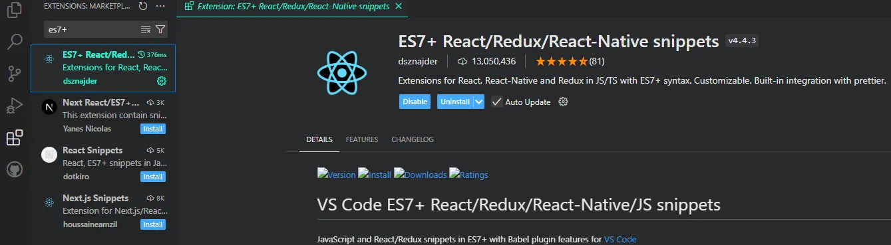
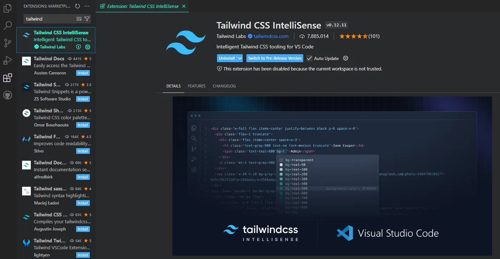
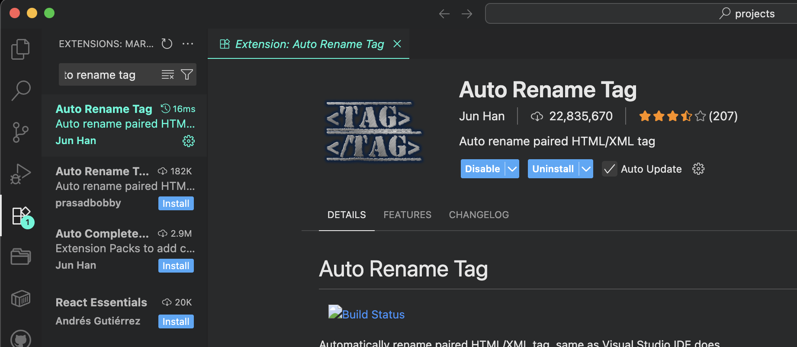

# Setup Installation Guide

Follow this tutorial in order to have your computer ready for building React web apps. Please make sure to complete this page before arriving to Devday.

## Overview

We will be installing the following:

- Node.js
- Visual Studio Code (VS Code)
- Visual Studio Code Extensions

---

## Node.js

1. Go to this [link](https://nodejs.org/en/download/prebuilt-installer) or search up "node.js".
2. If you're not already there, click on to the `Download` tab in the Navbar.

    

3. We recommend you install "NVM", which stands for Node Version Manager. It allows you to change which version of Node.js your machine will be using. This distinction is important because different projects use different versions of node.

    

4. Make sure that you’re installing the latest _stable_ version for the correct operating system.
5. Follow the installation wizard (if there is one).
    1. There are a few additional setup options, we recommend you do your research before clicking on anything 😬

At this point Node should be installed and you should be ready to move on to the next step.

:::caution
If you already had VS Code installed and opened _**before**_ your Node.js installation, make sure you fully close and restart VS Code or else it won’t recognize the installation of Node.js.
:::

---

## Git

1. Go to this [link](https://git-scm.com/) or search up "git".
2. Click the large "downloads" button

    

3. Follow the instructions based on your operating system.

    
    :::info
    If you're on MacOS, you may need to install [homebrew](https://brew.sh/) into your machine first.
    :::

---

## Visual Studio Code

1. Go to this [link](https://code.visualstudio.com/) or search up "visual studio code"
2. Click on the download button, and it should start shortly.

    

3. Follow the installation wizard
    1. There are a few additional setup options, we recommend you do your research before clicking on anything.

---

## Visual Studio Code Extensions

:::info
In this section, we will open up VS Code and install some quality-of-life extensions. If this is your first time using Visual Studio Code, we highly recommend that you go through the beginner tutorial steps that they have already setup for you. You can install these extensions once you get to the `extensions` section.
:::

1. On the sidebar, click on the Extensions icon (or use the shortcut `ctrl/cmd` + `shift` + `x`). We’re now going to be searching and installing a few extensions.

    

2. In the search bar type in **"prettier"**.

    

3. In the search bar type in **"es7+"**. There will be a few different options. Make sure it’s "ES7+ React/Redux/React-Native snippets" as pictured below.

    

4. In the search bar type in **"tailwind"**. It should be the one with 7.8 million installations.

    

5. Finally, in the search bar type in "auto rename tag".

    

Now your VS Code is set up with some of the essential extensions that will streamline your productivity!

---

## Congratulations

Awesome job for making it to the end of this section!

At this point, there is no need to go any further if you plan on attending Devday. The following page is dedicated to teaching you project initialization for the actual **day** of the hackathon event!
