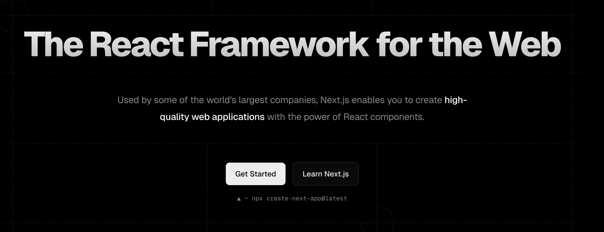
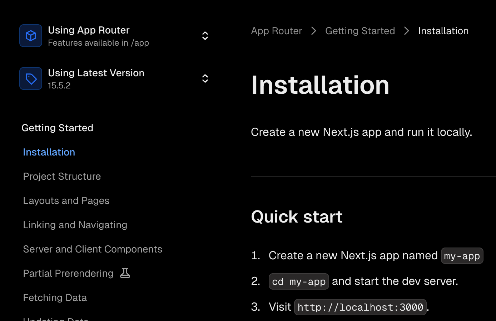
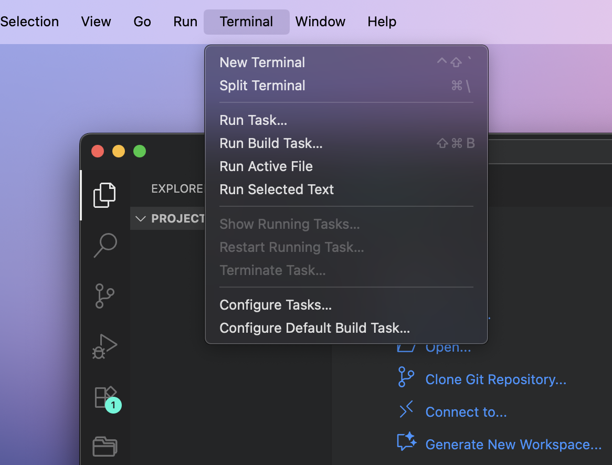
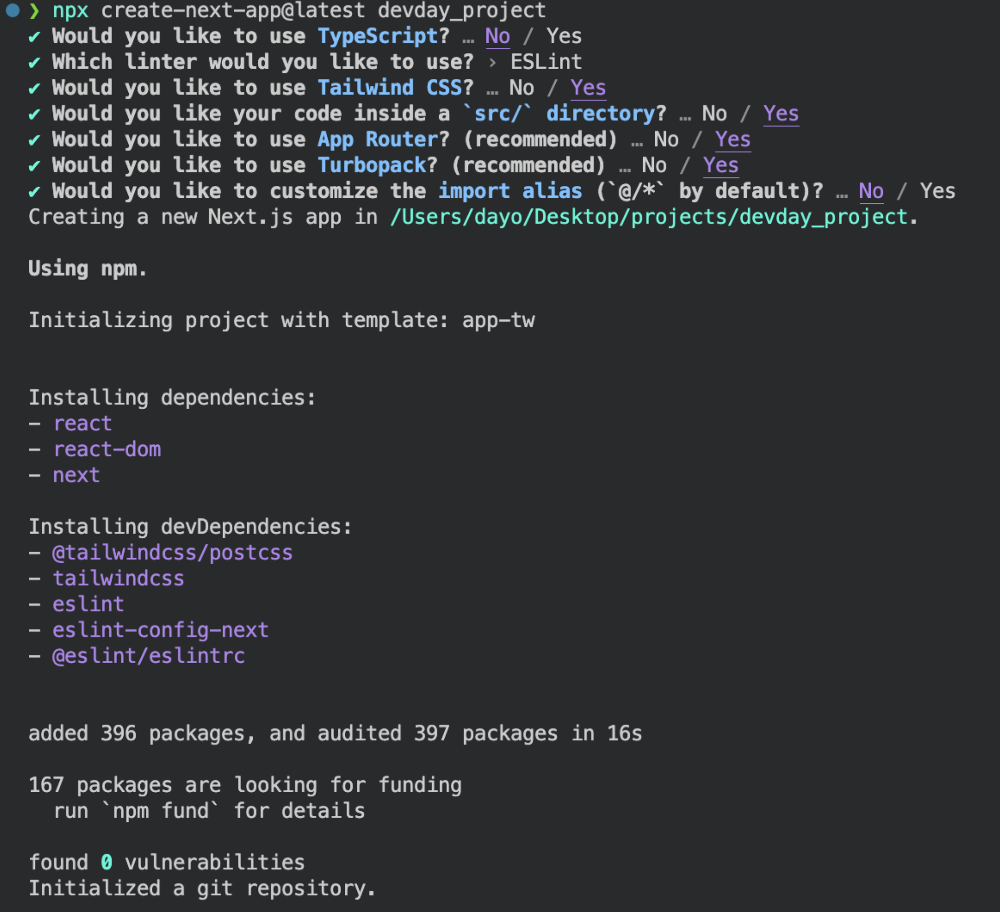
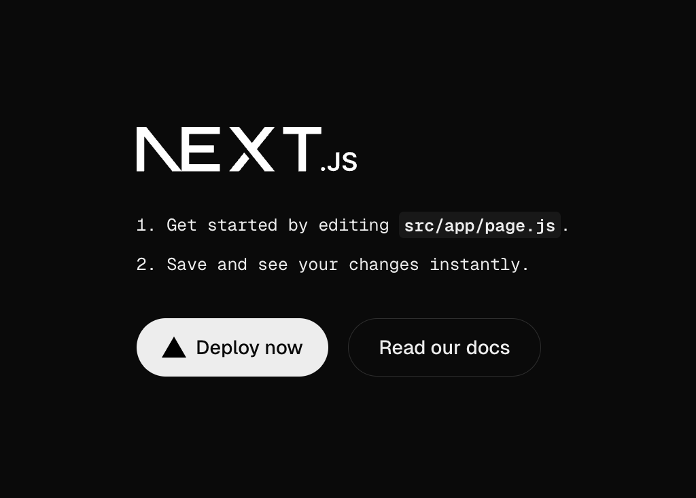

# Project Instantiation Guide

At this point, you should have installed everything necessary to start the development of this project! If not, head back to the [project setup page](../Webapp-Setup/installation-guide.md).

In this section, we won’t be creating any _**new**_ content. We will simply set up our Integrated Development Environment (VS Code in this case) so that it’s ready for us to start creating our web application.

:::caution
If you are attending **Devday**, there is **_no_** need to go any further at this point. We will be creating a **fork** of a starter project code that we already have set up for you. The only point in continuing the tutorial is to have an understanding of what to do on the actual **day** of the Hackathon (HackUTD 2025).
:::

---

## General File Directory Setup

:::info
Before we get into creating our first project, we want to make sure that we know **_where_** we’re building it. In this section, we will be creating a general folder that will _house_ all of our future projects.

_note_: If you already have a dedicated folder for projects, you can skip this step.
:::

1. Open up Visual Studio Code
2. Click on “File” in the top left corner and click on “Open Folder”
3. Navigate to wherever you want to create your new projects folder. Right-click in the file explorer to create a new folder to hold your project directory. \*You can skip this step if you already have a folder dedicated to your projects.

    
    1. Do note that this folder will be the **parent folder** and will **_not_** be the folder of the **actual project files** for this tutorial specifically. This means that this folder should be titled something generic such as “Projects” or even simply choose your Desktop.
    2. When we run the commands in the future steps, we will be creating a **new** folder **dedicated to the project itself**.

4. At this point, your VS Code should be in the `projects/` folder that we had made previously.

---

## Next.js

1. Go to this [link](https://nextjs.org/) or search up Next.js.
   :::tip
   An essential skill of a programmer is to become comfortable with reading documentation.
   :::
2. Click on "Get Started". Feel free to read through the features.
   
3. Click on `Installation` on the sidebar.
   
4. Open up the terminal. You can find the button in the top bar of VS Code (as shown below). You could also use the shortcut: `ctrl` + `shift` + \` which is the backtick symbol (found below the`Esc` key).
   
5. In your terminal, run the following command:

    ```bash
    npx create-next-app@latest devday_project
    ```

    :::info
    Make sure that you are in your `projects/` folder before running this command. For example, my terminal directory shows `/Users/dayo/Desktop/projects/`. And if I run the command in this folder, then it will be creating a new folder as the following: `/Users/dayo/Desktop/projects/devday_project/`.

    `npx create-next-app` is the command that installs the project

    `@latest` indicates the version we want to download

    `devday_project` is the title of the project. you can name it whatever you want
    :::

6. Copy this configuration for the installation.
   
7. At this point, there should be a new folder that contains your project boiler-plate.
8. Let's change our directory from the `projects/` and move into our project folder.
    1. In your terminal, run the command: `cd devday_project` (or whatever you named it).
9. Now that we're inside of the project folder, we can run `npx run dev` which will run the project on our a server via our local machine.
10. Click on the link to `localhost:3000` to see your website in action! It should look something like this:
    
11. To shut off your development server, go back to the terminal and hit `ctrl`+ `c`.
    To spin the server back up, run in your terminal: `npm run dev` again.

---

## Congratulations

And just like that, you're ready to start building your first ever web application! We are so proud of you for making it to this point, and encourage you to take a mindful break. Happy coding!
